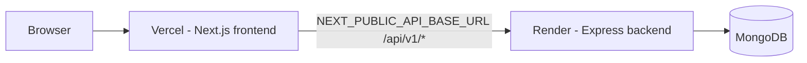
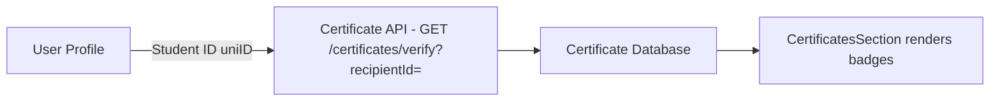
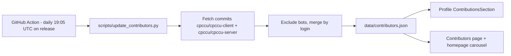
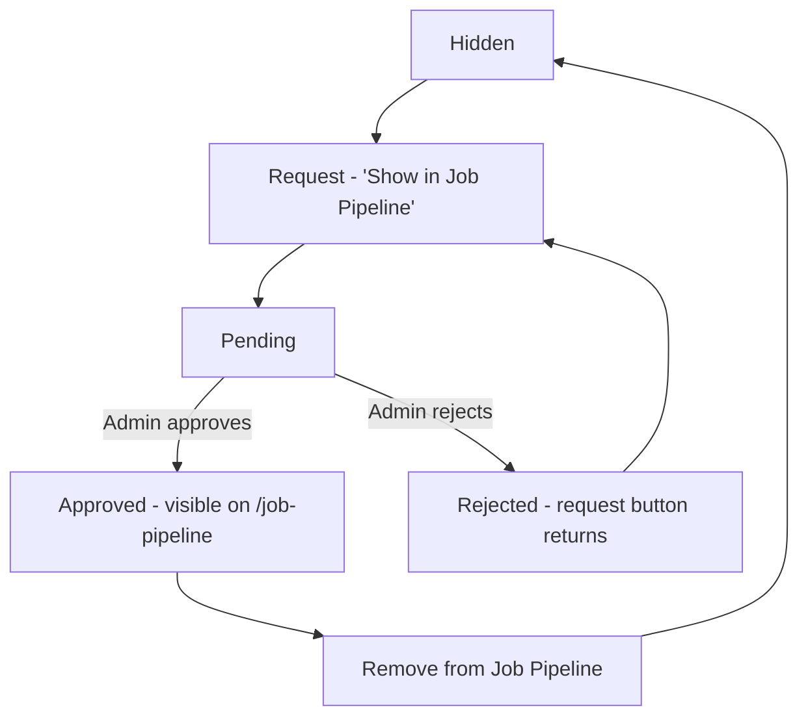

# Architecture Decision Records — CPCCU

This document records the most important architectural decisions made in the CPCCU project. Each ADR explains **why** the project is built this way, not just **how** it works.

> **Rule of thumb:** every decision below was verified against the current frontend codebase. Nothing here is hypothetical — decisions marked **Accepted** are implemented in production. Decisions marked **Planned** are not yet implemented.

Related documentation: [README](../README.md) · [ARCHITECTURE.md](./ARCHITECTURE.md) · [API_DOCUMENTATION.md](./API_DOCUMENTATION.md) · [DEPLOYMENT.md](./DEPLOYMENT.md) · [CLAUDE.md](./CLAUDE.md)

---

## ADR-001 — Frontend Deployment (Vercel) + Backend Deployment (Render)

### Status

Accepted

### Context

The CPCCU platform is split into two applications: the Next.js frontend (`cpccu-client`) and an Express/MongoDB backend (`cpccu-server`). Both need to be hosted, and each has different operational needs (the frontend is mostly static/CSR; the backend needs a long-running Node process and a database).

### Decision

- **Frontend** is deployed on **Vercel** (production: https://cpccu.club/).
- **Backend** is deployed on **Render** as a web service (`cpccu-server`).
- The frontend communicates with the backend through the **`NEXT_PUBLIC_API_BASE_URL`** environment variable (default `http://localhost:5000/api/v1`), used by `src/services/baseApi.js` (`fetchBaseQuery`), the public certificate API, and the certificate metadata fetcher.

### Why

- **Independent scaling & release cycles** — frontend and backend can deploy, roll back, and scale separately.
- **Static/CDN delivery** — Vercel serves the client-rendered app globally with automatic caching and HTTPS; no need for a self-managed Node server.
- **Backend needs a persistent runtime** — Render hosts the long-running API process and its database connection.
- **Operational separation** — API keys, DB credentials, and rate-limit-sensitive concerns stay server-side.

### Consequences

**Pros**

- Zero-downtime frontend releases; fast global delivery.
- Backend can be scaled/monitored independently.
- No shared infrastructure lock-in.

**Cons**

- CORS must be configured on the backend to accept the deployed origin.
- `NEXT_PUBLIC_*` variables are inlined at build time — changing them requires a redeploy.
- Every API call crosses the network to Render (no Vercel-side API proxying).

**Future considerations**

- Vercel Edge/Server Functions could proxy API calls if CORS or token handling ever becomes a problem.
- Keep the legacy `render.yaml`/`_render.yaml` files in mind if the frontend ever returns to Render hosting.

---

## ADR-002 — Certificates Are Not Stored in the User Profile

### Status

Accepted

### Context

Members earn certificates (contests, workshops, hackathons). Earlier designs risked duplicating certificate data inside each user's profile document, which would drift out of sync whenever certificates were issued, edited, or revoked.

### Decision

Certificates are **not stored inside the User model/profile document**. The certificate system (backend `Certificate` collection) is the **single source of truth**. The profile fetches them dynamically:

Implementation: `src/components/Layout/Profile.jsx` calls `useLazyVerifyCertificateQuery({ recipientId: user.uniID })` and maps the response with `getCertificatesFromResponse` (`src/lib/certificates/parser.js`).

### Why

- **Single source of truth** — one canonical certificate record, never duplicated.
- **No duplicate data** — nothing to reconcile between profiles and certificates.
- **Automatic synchronization** — any issue/edit/delete in the admin certificate module is reflected instantly on profiles.
- **Lower maintenance** — no sync jobs or dual-writes.
- **Certificates appear automatically** after issuance — no per-user profile update required.

### Consequences

**Pros**

- Profile data stays small and certificate-accurate.
- Admin certificate CRUD is the one place that manages certificate truth.
- Easy to extend (stats, verification logs, bulk issue) without touching user records.

**Cons**

- Profile rendering depends on a second API request (mitigated with skeleton loading).
- Lookup requires a stable student ID shared by both systems.

**Future considerations**

- Download/share permission checks (stubs in `src/lib/certificates/permissions.js`) will gate client actions when implemented.

---

## ADR-003 — Student ID (`uniID`) as the Primary Certificate Lookup

### Status

Accepted

### Context

Certificates are issued to students by their university student ID, while users in the database are identified by a MongoDB `_id`. The profile page needed a key to fetch a member's certificates.

### Decision

The profile uses the member's **student ID (`uniID`)** — not the MongoDB `_id` — as `recipientId` when querying certificates (`GET /certificates/verify?recipientId=<uniID>`).

### Why

- **Stability** — `uniID` is a stable, human-meaningful identifier independent of the database row.
- **Cross-system compatibility** — certificates and profiles are managed by separate systems; the student ID is the common key between them.
- **Independence from database implementation** — a `_id` is an implementation detail of MongoDB; `uniID` survives migrations, re-imports, and future backends.
- **Easier integration with external systems** — universities, organizers, and recruiters already reference students by ID.
- **Validation is centralized** — `src/lib/id-validation.js` guards the format (digits only, 6–20 chars, no scientific notation) at signup and profile edit.

### Consequences

**Pros**

- Lookups are deterministic and portable.
- No coupling between the profile document and certificate records.

**Cons**

- The `uniID` must be identical in both the user record and the certificate record — typos silently produce an empty certificate section.
- Changing a student ID (rare) requires updating both systems.

**Future considerations**

- Consider a fallback lookup by email for edge cases where the ID format differs between systems.

---

## ADR-004 — Contributor Data via GitHub Action + `contributors.json` (Not Direct GitHub API)

### Status

Accepted

### Context

The site displays contributors with commit counts and ranks. Calling the GitHub API directly from the frontend would expose rate limits, require a token, and slow down page loads.

### Decision

Contributor data is produced **off the critical path** by an automated pipeline and consumed as a static asset:

- `.github/workflows/update-contributors.yml` runs daily on the `release` branch.
- `scripts/update_contributors.py` merges commit counts from both repositories and preserves manually curated fields (name, role, department, batch, LinkedIn).
- The frontend reads `data/contributors.json` via `src/lib/public-content.js` helpers (`extractGithubUsername`, `findContributorByGithub`, `parseContributionInfo`).

### Why

- **No API rate limits** — GitHub's REST API is never called from the browser or at render time.
- **Faster page loads** — contributor data is a small static JSON file, cached like any other asset.
- **No GitHub token exposure** — the token used by the workflow lives only in GitHub Actions secrets.
- **Static asset caching** — the JSON is served from the CDN; no dynamic fetch cost.
- **Simpler frontend** — no fetch logic, error states, or API keys in the client.

### Consequences

**Pros**

- Zero client-side cost; fully offline-able data.
- Bots and automated users are filtered once, in the pipeline.

**Cons**

- Data freshness lags by up to a day (daily schedule).
- The workflow must run against the correct branch (`release`) to stay current.

**Future considerations**

- Add a build-time metadata endpoint or trigger the workflow on push if fresher data is ever needed.

---

## ADR-005 — Dynamic Role Management (Official Roles Stored Separately)

### Status

Accepted

### Context

The club needs two very different kinds of roles: **system permissions** that control who can access what, and **official position titles** (President, Vice President, General Secretary…) that are displayed on profiles. Hardcoding the official titles in the UI would require a code deploy every time the committee changes.

### Decision

- **Panel / system roles** (`admin`, `moderator`, `mentor`, `member`) are backend permissions, enforced by the backend and the admin layout guard (`src/app/admin/layout.jsx`).
- **Official CPCCU roles** are stored as records in the `Role` collection and managed dynamically by admins through `/admin/roles` endpoints (`GET/POST /admin/roles`, `PATCH /admin/roles/:id`, `PATCH /admin/roles/:id/toggle`), with the management UI inside the Members module.
- Display logic is centralized in `src/lib/roles.js` (`normalizeRole`, `isOfficialRole`, `getDisplayRole`, `roleIcon`, `roleBadgeColor`, `sortRoles`), and `getDisplayRole` maps system roles back to "Member" so permissions are never displayed as titles.

### Why

- **Committees change every term** — admins can add/rename/toggle roles without a deploy.
- **Separation of concerns** — permissions (what you can do) are decoupled from titles (what you're called).
- **Consistent display** — one utility module drives badge color, icon, and display name everywhere.
- **Self-service** — the panel UI (role dropdown + creation) lives where admins already manage members.

### Consequences

**Pros**

- Role changes are data-driven and instantly reflected on profiles.
- System security model stays small and auditable.

**Cons**

- Two role systems can confuse newcomers (mitigated by documentation).
- Role records must be seeded/kept in sync with the club structure.
- Official role display depends on the `active` flag.

**Future considerations**

- Consider deriving profile badges from role IDs instead of names to avoid rename drift.

---

## ADR-006 — Profile Page Divided into Independent Sections

### Status

Accepted

### Context

A profile must show many different kinds of data (identity, bio, skills, certificates, projects, contributions, contact). A single monolithic component became hard to maintain as each section gained its own loading, empty, and edit states.

### Decision

The profile page (`src/components/Layout/Profile.jsx`) is composed of independent section components in `src/components/PROFILE/`:

| Section | Component |
| --- | --- |
| Hero | `ProfileHero.jsx` |
| About | `AboutSection.jsx` |
| Member Info | `MemberInfoSection.jsx` |
| Quick Stats | `QuickStats.jsx` |
| Skills | `SkillsSection.jsx` |
| Certificates | `CertificatesSection.jsx` |
| Projects | `ProjectsSection.jsx` |
| Contact | `ContactSection.jsx` |
| Contributions | `ContributionsSection.jsx` |

Shared building blocks: `SectionCard.jsx`, `EmptyState.jsx`, `AnimatedCounter.jsx`, `BrandIcons.jsx`.

### Why

- **Easier maintenance** — each section can be changed without touching the others.
- **Better code organization** — one component per concern, clear file names.
- **Independent loading** — sections render their own skeletons/empty states (e.g., certificates load lazily while the hero is already visible).
- **Component reusability** — sections are plain presentational components; the same patterns serve admin and public views.

### Consequences

**Pros**

- Small, focused files; parallel development.
- Owner-vs-public permissions apply per section (edit mode, job pipeline, project CRUD).

**Cons**

- Sections receive many props from the parent and must agree on the member data shape.
- Legacy unused profile components remain in the folder (documented in [ARCHITECTURE.md](./ARCHITECTURE.md) §18).

**Future considerations**

- Extract each section's data fetching into hooks if the parent `Profile.jsx` grows further.

---

## ADR-007 — Job Pipeline Approval Workflow

### Status

Accepted

### Context

The public job pipeline showcases members to recruiters. If members could publish directly, the page could contain outdated, incomplete, or low-quality profiles with no moderation.

### Decision

Publishing is gated by an admin approval workflow:

- Member side: `ProfileHero.jsx` + `src/components/Layout/Profile.jsx` (request modal, status badges) using `POST/DELETE /users/job-pipeline-request`.
- Admin side: `/admin/jobs` (`jobs-content.jsx`) supports **approve**, **reject**, **revert to pending**, and **remove** on `DeveloperProfile` records.
- Public side: `/job-pipeline` renders only approved profiles from `GET /content/profiles` (fallback to `data/job-pipeline/Info.json`).

### Why

- **Quality control** — only complete, curated profiles reach recruiters.
- **Club brand protection** — public showcase reflects the club's standards.
- **Prevents spam/abuse** — approval stops irrelevant or duplicate submissions.
- **Clear lifecycle** — every profile has an explicit, auditable state (`hidden`, `pending`, `approved`, `rejected`).

### Consequences

**Pros**

- Safe public surface with a full audit trail.
- Members get feedback (rejection reason stored) and can re-request.

**Cons**

- Adds friction for members and review workload for admins.
- Approved profiles only appear after review (delay between request and visibility).

**Future considerations**

- Add approval notifications (see ADR-012) so members know when their profile is live.

---

## ADR-008 — RTK Query for Server State

### Status

Accepted

### Context

The app performs many API calls (auth, users, content, admin, certificates) that need consistent loading/error states and cache invalidation. Hand-writing `fetch` + Redux action/selector boilerplate per feature would be repetitive and error-prone.

### Decision

All API access uses **RTK Query** (`@reduxjs/toolkit/query`):

- A single `baseApi` (`src/services/baseApi.js`) with centralized tag types, auth header injection, and `credentials: 'include'`.
- Feature modules register endpoints via `baseApi.injectEndpoints()` (`authApi`, `userApi`, `memberApi`, `certificateApi`, `contentApi`, `contactApi`, `adminApi`).
- A separate `publicApi` instance handles unauthenticated certificate verification.
- Cache invalidation is driven by tag types (`Auth`, `Users`, `Posts`, `Projects`, `PublicContent`, `AdminOverview`, `AdminMembers`, `AdminContent`, `AdminStatistics`, `AdminCertificates`, `AdminSystemSettings`, `AdminRoles`).

### Why

- **Automatic caching** — identical queries are deduplicated and cached automatically.
- **Cache invalidation** — mutations invalidate tags so dependent queries refetch (e.g., admin content updates refresh the public page).
- **Loading & error states** — every hook exposes `isLoading`, `isError`, `data`, `refetch` without extra code.
- **Reduced boilerplate** — no manual request state management per feature.

### Consequences

**Pros**

- Consistent data flow across public and admin areas.
- Less code, fewer hand-rolled state bugs.

**Cons**

- Learning curve for RTK Query concepts (tags, injectEndpoints, lazy queries).
- Cache freshness depends on correct tag wiring; the `serializableCheck` is disabled for the store.
- A few direct `fetch` calls remain intentionally (visitor counter, bootcamp leaderboard, server-side certificate metadata).

**Future considerations**

- Register stray slices (`userSlice`, `memberSlice`, `postSlice`) or remove them (see [ARCHITECTURE.md](./ARCHITECTURE.md) §18).

---

## ADR-009 — Shared Utility Modules

### Status

Accepted

### Context

The same logic — role display, certificate parsing/sorting, public content mapping, ID validation, password rules — is needed in many components across public and admin areas.

### Decision

Reusable logic lives in centralized modules under `src/lib/`:

- `src/lib/roles.js` — official role normalization, detection, icons, badge colors.
- `src/lib/certificates/` — parsing (`parser.js`), sorting (`sorting.js`), badges (`badges.js`), permission stubs (`permissions.js`), re-exports (`index.js`).
- `src/lib/public-content.js` — API→view mappers (`toPublicContributor`, `toPublicEvent`, `toPublicDeveloperProfile`, …) and GitHub helpers.
- Also: `id-validation.js`, `password-validation.js`, `format-date.js`, `alerts.js`, `cropImage.js`.

### Why

- **Centralized logic** — one implementation, one place to fix bugs.
- **Avoid duplicated code** — no copy-pasted parsing/formatting across components.
- **Easier maintenance** — behavior changes in one file and propagates everywhere.
- **Consistent behavior** — public, profile, and admin views render data the same way.

### Consequences

**Pros**

- Smaller components; predictable output shapes.
- Utilities are unit-testable in isolation.

**Cons**

- Utility modules must stay in sync with API response shapes.
- Modules can become grab-bags if new helpers aren't grouped well.

**Future considerations**

- Add unit tests for parsers and validators as the test suite grows.

---

## ADR-010 — Security Headers via `proxy.ts`

### Status

Accepted

### Context

The deployed site needed defense-in-depth HTTP security headers without relying on infrastructure-level configuration.

### Decision

`src/proxy.ts` (Next.js 16 proxy/middleware) applies security headers to every route except `_next/static` and `_next/image`:

- **Content-Security-Policy** (production only) — restricts script/style/img/connect/font sources, `frame-ancestors 'none'`, `form-action 'self'`.
- **X-Content-Type-Options** — `nosniff`
- **Referrer-Policy** — `strict-origin-when-cross-origin`
- **Permissions-Policy** — disables camera, microphone, geolocation, usb, payment, and more.
- **X-Frame-Options** — `DENY`
- **Cross-Origin-Embedder/Opener/Resource-Policy** — hardening against embedding/cross-origin leaks.
- **Strict-Transport-Security (HSTS)** — applied when the host is not localhost.

External scan results (as reported): **SecurityHeaders → Grade A**, **MDN Observatory → B+** (current status — re-validate after any header changes).

### Why

- Headers travel with the app — no host-specific configuration needed.
- CSP + HSTS + frame/embedding restrictions raise the cost of XSS, clickjacking, and downgrade attacks.
- Production-only CSP avoids breaking local development.

### Consequences

**Pros**

- Strong baseline security posture on every response.
- Easy to inspect and change in one file.

**Cons**

- CSP `connect-src` must be updated when new external origins (fonts, CDNs, APIs) are added, or requests will be blocked.
- Headers protect the transport/browser layer only — application-level authorization is still required.

**Future considerations**

- Move the CSP to a strict, hash-based policy if inline styles/scripts are ever reduced.

---

## ADR-011 — Authentication Architecture

### Status

Accepted

### Context

Users need to log in, maintain sessions across page loads, and access role-restricted admin areas.

### Decision

Verified from the code (`src/features/auth/authSlice.js`, `authApi.js`, `src/app/redux/ProviderWrapper.js`):

- **JWT storage** — the access token is stored in `localStorage` (`token`) and the user object in `localStorage` (`user`).
- **Authorization headers** — `baseApi` attaches `Authorization: Bearer <token>` when a token exists and sets `credentials: 'include'`.
- **Session hydration** — on app load, `ProviderWrapper` validates the token via `GET /users/user` and dispatches `setCredentials` / `clearCredentials` / `setHydrated`.
- **Protected routes** — `/admin` is guarded client-side for roles `admin`, `moderator`, `mentor`; unauthenticated users are redirected to `/login`.
- **Registration** — email OTP flow (`POST /auth/send-otp` → `POST /auth/verify-registration`).
- **Password reset** — `GET /auth/reset-link/:email` + `PATCH /auth/reset-password`.
- **Google authentication** — **not implemented** on the frontend. There is no Google OAuth / Firebase code, and **no refresh-token flow** exists.

### Why

- Simple, stateless client session with minimal infrastructure.
- Bearer headers work across the whole RTK Query layer automatically.
- Hydration on startup keeps auth-aware UI consistent after refreshes.

### Consequences

**Pros**

- Straightforward to implement and debug; no refresh orchestration.
- Admin access gating is centralized in the admin layout.

**Cons**

- `localStorage` tokens are readable by any XSS — keep CSP strong and avoid injecting untrusted HTML.
- Sessions end when the token expires (no automatic refresh); the user is cleared on the next validation failure.
- Google OAuth is **not present** — do not document or assume it exists.

**Future considerations**

- Move to HTTP-only cookie sessions or add a refresh-token rotation flow (see ADR-012).

---

## ADR-012 — Future Decisions (Planned, Not Implemented)

> The following are **Planned** directions. None of them are implemented in the current codebase — treat them as proposals, not facts.

### 1. Notification System

**Planned.** Notification *preference toggles* already exist in the admin System Settings (`system-settings-content.jsx`: `emailNewPost`, `emailProfileSubmission`, `browserNotifications`), but there is **no notification delivery engine** (no in-app inbox, no push/email sending) on the frontend.

### 2. Certificate PDF Download

**Planned.** `src/lib/certificates/permissions.js` contains `canDownloadCertificate` / `canShareCertificate` / `canEditCertificate` / `canDeleteCertificate` **stubs that always return `false`**; the Download button in `CertificatesSection` is disabled with a "Coming Soon" tooltip.

### 3. Share Certificates

**Planned.** The same `permissions.js` stubs prepare share checks; no share implementation exists yet.

### 4. QR Verification

**Planned.** Certificates currently verify by ID/name/student ID search. A QR-code verification flow (scan → `/certificate/[certificateId]`) is a natural extension of the existing detail page.

### 5. Print Certificates

**Planned.** No print stylesheet or print action exists for certificate cards.

### 6. Email Service

**Planned.** Email is currently limited to password-reset links and OTP via the backend. A general email service (newsletters, notifications) is not implemented.

### 7. WebSocket / Real-Time Notifications

**Planned.** All current data flow is request/response via RTK Query. Real-time updates (e.g., live dashboard signals, in-app notifications) would require a WebSocket/SSE layer and are not implemented.

### 8. Google OAuth / Refresh Tokens

**Planned.** Not implemented (see ADR-011). If adopted, would replace or complement the current localStorage bearer-token session.

---

## Document History

- ADR-001 to ADR-012 created during the documentation audit (August 2026).
- All "Accepted" ADRs verified against the current `cpccu-client` codebase.
