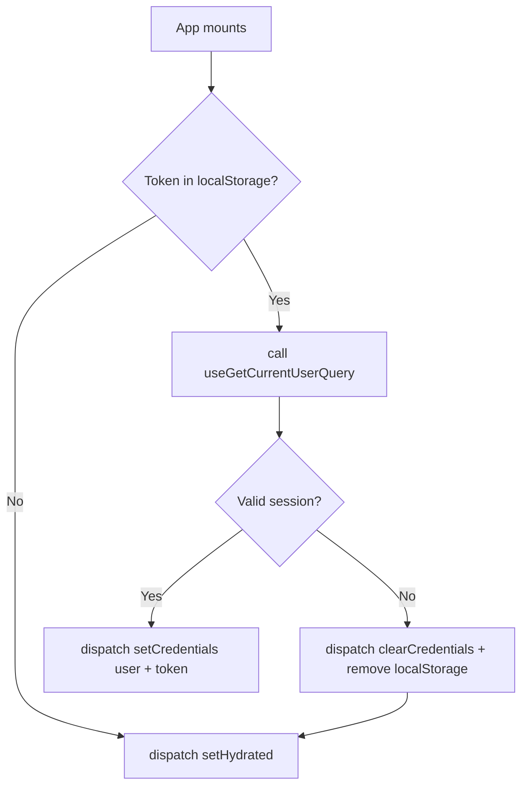
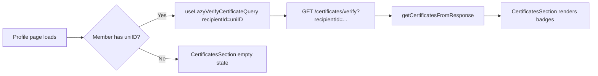
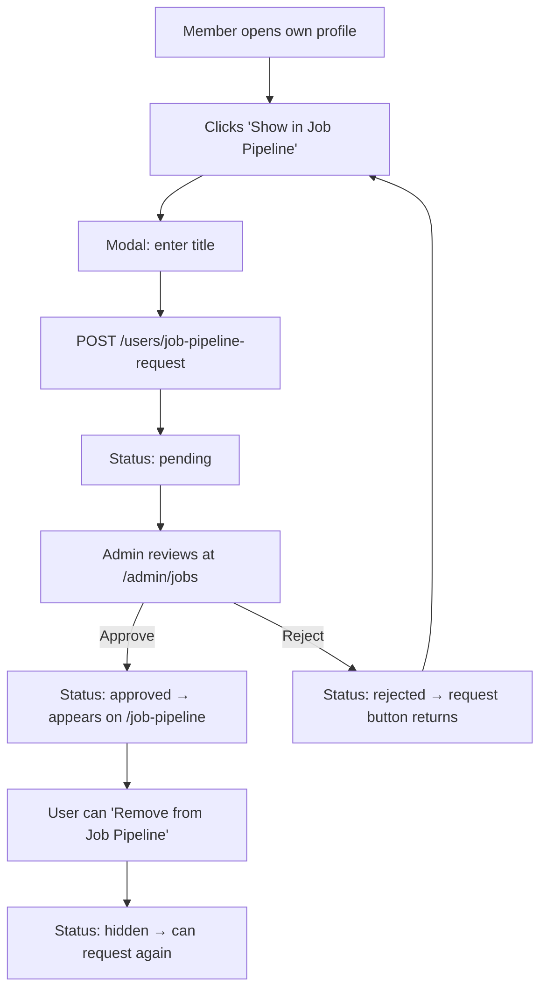
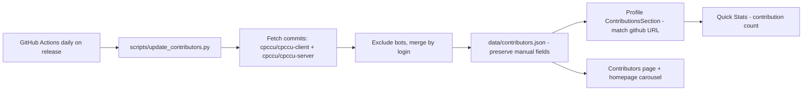

# CPCCU Frontend Architecture Documentation

This document describes the current architecture of the `cpccu-client` repository as it exists in production.

> **Rule of thumb:** when documentation and code disagree, **the code is correct**. This document is verified against the source tree.

> **Looking for the reasoning behind key decisions?** See [ADR.md](./ADR.md) — Architecture Decision Records covering deployment, certificates, roles, the profile system, the job pipeline, RTK Query, security headers, and auth.

## 1. Technology Stack

| Layer | Technology |
| --- | --- |
| Framework | Next.js 16 (App Router, `src/` directory) |
| Runtime UI | React 19 |
| Language | JavaScript (ES modules, JSX) |
| State Management | Redux Toolkit |
| Server State / Data Fetching | RTK Query |
| Styling | Tailwind CSS 4, Tailwind CSS Animate, Tailwind Merge |
| UI Component System | Radix UI primitives + `class-variance-authority` |
| Animation | Framer Motion |
| Icons | Font Awesome, Lucide React, React Icons |
| Validation | Zod |
| Date Handling | date-fns, React Day Picker |
| Charts | Recharts |
| Carousels | Embla Carousel React |
| Notifications | Sonner, SweetAlert2 |
| Command Palette | cmdk |
| OTP Input | input-otp |
| Image Crop | react-easy-crop |
| Upload | upload-js (Cloudinary) |
| Scroll | react-scroll, react-scroll-trigger |
| Panels | react-resizable-panels |
| Counters | react-countup |
| Spreadsheet Export | xlsx |
| Package Manager | npm / Bun |

## 2. Repository Layout

```
cpccu-client/
├── .github/workflows/       # update-contributors.yml — daily contributor sync
├── data/                    # Static JSON content sources (fallback data)
├── DOCUMENTATION/           # Project docs (this file, API docs, deployment, etc.)
├── lib/                     # Root-level shared utilities (cn.js)
├── public/                  # Static assets
├── scripts/                 # update_contributors.py
├── src/
│   ├── app/                 # Next.js App Router pages & layouts
│   ├── components/          # Feature and shared UI components
│   ├── Context/             # Scroll-based section contexts
│   ├── features/            # Redux slices + RTK Query endpoint modules
│   ├── hooks/               # use-admin-content, use-mobile, use-toast
│   ├── lib/                 # Utilities (roles, certificates, public-content, ...)
│   ├── proxy.ts             # Next.js 16 proxy (security headers)
│   └── services/            # RTK Query base API setup
```

## 3. Routing Architecture (App Router)

### 3.1 Root Shell

- Root layout `src/app/layout.jsx` imports `globals.css`, sets global metadata (`metadataBase` = `https://www.cpccu.club`), loads the Inria Sans Google Font, and wraps the app in `ProviderWrapper` (Redux Provider + auth hydration).
- `src/app/ScrollToTop.jsx` provides global scroll-to-top behavior.
- `src/app/not-found.jsx` renders the custom 404 page.

### 3.2 Main Public Route Group (`(main)`)

- Shared shell in `src/app/(main)/layout.jsx`: `Header` → `NavBar` → children → `Footer` → `GoToTop`.

| Route | Page |
| --- | --- |
| `/` | Homepage |
| `/blog` | Blog listing |
| `/bootcamp-leaderboard` | Bootcamp leaderboard |
| `/certificate` | Certificate verification portal |
| `/certificate/[certificateId]` | Per-certificate detail page (SSR metadata) |
| `/committee` | Committee page |
| `/contact` | Contact page |
| `/contributors` | Contributors page |
| `/donators` | Donators page |
| `/event` | Event page |
| `/gallery` | Gallery page |
| `/history` | Club history |
| `/job-pipeline` | Developer job pipeline |
| `/member` | Member directory |
| `/profile/[id]` | Public profile page |
| `/users/profile/[id]` | Legacy alias for the same profile page |

### 3.3 Auth and Utility Routes

| Route | Page |
| --- | --- |
| `/login` | Login page |
| `/signup` | Registration page with OTP verification |
| `/reset-password/[code]/[token]` | Password reset page |
| `/verify/[certificateId]` | Redirects to `/certificate/[certificateId]` |

### 3.4 Admin Routes (`/admin`)

- Client-side guarded layout: `src/app/admin/layout.jsx` redirects unauthenticated users to `/login` and shows an "Admin access required" screen for non-admin roles (`admin`, `moderator`, `mentor`).

| Route | Module |
| --- | --- |
| `/admin` | Dashboard |
| `/admin/members` | Members (incl. official role management) |
| `/admin/posts` | Posts |
| `/admin/messages` | Contact messages |
| `/admin/events` | Events |
| `/admin/gallery` | Gallery |
| `/admin/jobs` | Developer profiles / job pipeline |
| `/admin/alumni` | Alumni |
| `/admin/contributors` | Contributors |
| `/admin/donators` | Donators |
| `/admin/committees` | Committees |
| `/admin/certificates` | Certificates |
| `/admin/statistics` | Site statistics |
| `/admin/audit-logs` | Audit logs |
| `/admin/settings/account` | Account settings |
| `/admin/settings/system` | System settings |

## 4. State Management and Data Flow

### 4.1 Active Store Configuration

The active store is `src/app/redux/store.js`.

Registered reducers:

| Key | Source |
| --- | --- |
| `api` | `baseApi` RTK Query reducer |
| `publicApi` | public certificate API reducer |
| `auth` | auth slice |
| `certificate` | certificate slice |

Middleware: `baseApi.middleware`, `publicApi.middleware`. The serializable check is disabled.

> `src/app/redux/rootReducer.js` is **stale** (it imports `usersSlice`/`postsSlice` files that do not exist) and is **not** used by the active store.

### 4.2 Auth Hydration Flow

`src/app/redux/ProviderWrapper.js` performs hydration on app load:



1. `AuthHydrator` reads the token from `localStorage`.
2. If a token exists, it calls `useGetCurrentUserQuery` to validate the session.
3. On success it dispatches `setCredentials` with the user and token.
4. On failure it dispatches `clearCredentials` and removes the `user`/`token` localStorage items.
5. `setHydrated` is dispatched in all cases to unblock auth-aware UI.

### 4.3 Slice Responsibilities

| Slice | File | Registered | Purpose |
| --- | --- | --- | --- |
| `auth` | `src/features/auth/authSlice.js` | ✅ | `user`, `token`, `loading`, `error`, `hydrated`; `setCredentials` / `clearCredentials` / `setHydrated`; localStorage persistence |
| `certificate` | `src/features/certificate/certificateSlise.js` | ✅ | Certificate search form state (`searchData`) and verification result (`result`); `setSearchData` / `setCertificateResult` / `clearCertificateResult` |
| `users` | `src/features/users/userSlice.js` | ❌ | Exists but **not registered** in the active store |
| `members` | `src/features/members/memberSlice.js` | ❌ | Exists but **not registered** in the active store |
| `posts` | `src/features/posts/postSlice.js` | ❌ | Exists but **not registered** in the active store |

### 4.4 RTK Query API Layer

- `src/services/baseApi.js` — the single `createApi` instance (reducer path `api`). Feature modules inject endpoints via `baseApi.injectEndpoints()`.
- `src/features/certificate/certificateApi.js` also defines `publicApi` — a separate `createApi` instance (reducer path `publicApi`) without auth headers for public certificate verification.

**Tag types** (cache invalidation):

```
Auth, Users, Posts, Projects, PublicContent,
AdminOverview, AdminMembers, AdminContent, AdminStatistics,
AdminCertificates, AdminSystemSettings, AdminRoles
```

> ⚠️ Code quirk: `memberApi.js` provides a `Members` tag, but `Members` is **not** declared in `baseApi.tagTypes`.

**Endpoint injection modules:**

| Module | File | Covers |
| --- | --- | --- |
| `authApi` | `features/auth/authApi.js` | login, register, send-otp, otp-verify, current user, logout, password reset |
| `userApi` | `features/users/userApi.js` | user CRUD, image upload, job pipeline request/remove, password change, account deletion, projects CRUD |
| `memberApi` | `features/members/memberApi.js` | public member directory |
| `certificateApi` | `features/certificate/certificateApi.js` | certificate verify/search, stats, recent + public verify |
| `contentApi` | `features/content/contentApi.js` | public content + statistics |
| `contactApi` | `features/contact/contactApi.js` | contact form submission |
| `adminApi` | `features/admin/adminApi.js` | admin overview, members, content, roles, statistics, system settings, certificates, image upload |

### 4.5 Direct Fetch (non-RTK Query)

| Location | Purpose |
| --- | --- |
| `src/components/HOME/VisitorCounter.jsx` | Visitor count fetch + increment |
| `src/components/BOOTCAMPLEADERBOARD/BootcampLeaderboard.jsx` | Bootcamp leaderboard data |
| `src/lib/certificate-metadata.js` | Server-side fetch for certificate detail page metadata |

## 5. Security Middleware (`src/proxy.ts`)

`src/proxy.ts` implements Next.js 16's proxy (middleware) convention. It exports `proxy(request)` and applies security headers to every route except `_next/static` and `_next/image` (via `config.matcher`):

- **Content-Security-Policy** — production only; restricts script/style/img/connect/font sources.
- **X-Content-Type-Options** — `nosniff`
- **Referrer-Policy** — `strict-origin-when-cross-origin`
- **Permissions-Policy** — disables camera, microphone, geolocation, usb, payment, accelerometer, gyroscope, magnetometer
- **X-Frame-Options** — `DENY`
- **Cross-Origin-Embedder-Policy** — `unsafe-none`
- **Cross-Origin-Opener-Policy** — `same-origin`
- **Cross-Origin-Resource-Policy** — `same-origin`
- **Strict-Transport-Security** — HSTS when the host is not `localhost`/`127.0.0.1`/`0.0.0.0`

## 6. Authentication

The frontend uses a **single access-token** JWT flow (there is no refresh-token or Google OAuth flow on the frontend):

1. **Login** (`POST /auth/login`) returns `{ user, token }`; the token is stored in `localStorage` (`token`) and the user in `localStorage` (`user`).
2. **Requests** — `baseApi` attaches `Authorization: Bearer <token>` when a token exists and sets `credentials: 'include'` for cookie-based backend flows.
3. **Session validation** — `ProviderWrapper` re-validates the token on app load via `GET /users/user`.
4. **Logout** — `GET /auth/logout` + `clearCredentials` (removes localStorage).
5. **Protected routes** — the admin layout is guarded client-side for roles `admin`, `moderator`, `mentor`. Non-admin users see "Admin access required".

Registration uses **email OTP verification**: `POST /auth/send-otp` → `POST /auth/verify-registration`, handled by `OtpVerifyPopup` after `POST /auth/register`.

Password reset: `GET /auth/reset-link/:email` sends the reset email; `PATCH /auth/reset-password` (with `code` + `token` from the URL) completes it. Passwords are validated with `src/lib/password-validation.js`.

## 7. Profile System

Route: `/profile/[id]` (page in `src/app/(main)/profile/[id]/page.jsx`, layout `src/components/Layout/Profile.jsx`).

### 7.1 Page Data Flow

- The page reads the current user from Redux; if the requested `id` matches the logged-in user (`_id` or `uniID`) it renders the local user, otherwise it fetches the public user via `useFetchUserByIdQuery` (`GET /users/user/:id`).
- Skeleton loading, "Unable to Load Profile" (error) and "Profile Not Found" states are handled in the page.
- Ownership (`isOwnProfile`) gates edit mode, image upload, project CRUD, and job pipeline controls.

### 7.2 Sections (active components in `src/components/PROFILE/`)

| Section | Component | Purpose |
| --- | --- | --- |
| Hero | `ProfileHero.jsx` | Avatar, cover band, official-role badge, department/batch/ID/member-since, socials, owner actions (Edit, Job Pipeline, Logout) |
| About | `AboutSection.jsx` | Biography / about text |
| Member Info | `MemberInfoSection.jsx` | Contact + academic details |
| Skills | `SkillsSection.jsx` | Skills with `skillName` + `experience` (grouped) |
| Projects | `ProjectsSection.jsx` | Portfolio projects (owner can CRUD/reorder) |
| Certificates | `CertificatesSection.jsx` | Dynamically fetched certificates (see §8) |
| Contributions | `ContributionsSection.jsx` | GitHub contributor widget (see §11) |
| Contact | `ContactSection.jsx` | Contact links |
| Quick Stats | `QuickStats.jsx` | Animated counters (projects, certificates, contributions) |
| Shared | `SectionCard.jsx` / `EmptyState.jsx` | Section wrapper + empty state |
| Utility | `AnimatedCounter.jsx`, `BrandIcons.jsx` | Counter animation + brand icons |
| Image | `ImageUploadModal.jsx`, `ProfileImageCropModal.jsx` | Upload + react-easy-crop flow |

> Legacy/unused profile components (`ProfileCard`, `ProfileDetails`, `ProfileID`, `ProfileBlog`, `Profile_Blog_Modal`, `ProfileNotFound`, `AchievementBadges`) remain in the folder but are only referenced by the unused `src/components/Layout/Profile1.jsx`.

### 7.3 Owner Permissions

- Edit toggle → inline form updates (`PATCH users/userInfo-update`).
- Avatar upload → `PATCH users/user/upload-image/:key` (crop via `src/lib/cropImage.js`).
- Skills add/remove/update.
- Projects create/update/delete.
- Job pipeline request/remove (see §9).

### 7.4 Public Profile Permissions

Visitors can view all sections; owner-only controls (edit, image upload, project management, job pipeline actions, logout) are hidden. Certificates and projects are fetched with public endpoints.

## 8. Certificate System

### 8.1 Verification Portal

- `/certificate` — search form (`VerifyForm`), stats (`CertificateStats`), recent certificates (`RecentCertificates`).
- `/certificate/[certificateId]` — same page pre-filled with the ID; `generateMetadata` calls `getCertificateMetadata` (server-side fetch of `GET /certificates/verify?certificateId=...`).
- `/verify/[certificateId]` — legacy route that redirects to `/certificate/[certificateId]`.

### 8.2 APIs

| Endpoint | API | Auth |
| --- | --- | --- |
| `GET /certificates/verify?certificateId=&recipientName=&recipientId=` | `certificateApi.verifyCertificate` | Yes (lazy, used by profile) |
| `GET /certificates/stats` | `certificateApi.getCertificateStats` | Yes |
| `GET /certificates/recent` | `certificateApi.getRecentCertificates` | Yes |
| `GET /verify/:certificateId` | `publicApi.verifyCertificatePublic` | No |

Search behavior: `certificateId` exact match; `recipientName` partial case-insensitive; `recipientId` case-insensitive. Name/ID searches can return multiple certificates.

### 8.3 How the Profile Integrates with Certificates



Key facts:

- Certificates are **NOT stored in the user profile**.
- They are **fetched dynamically** from the certificate system using the member's **student ID** (`uniID`).
- The existing certificate system (backend `Certificate` collection) is the **single source of truth**.
- The profile only displays them; admins issue/verify certificates through `/admin/certificates`.

### 8.4 Utilities (`src/lib/certificates/`)

| File | Responsibility |
| --- | --- |
| `parser.js` | `getCertificatesFromResponse` — safely extracts an array from any response shape |
| `sorting.js` | `sortCertificatesNewest`, `sortCertificatesOldest`, `sortByIssueDate` |
| `badges.js` | Badge labels/colors/icons by certificate type (`winner`, `runner-up`, `participation`, ...) |
| `permissions.js` | Stubs preparing download/share/edit/delete capability checks (all return `false`) |
| `index.js` | Re-exports |

## 9. Job Pipeline

Public route `/job-pipeline` (component `src/components/Layout/JobPipeline.jsx`) reads approved developer profiles via `contentApi` (`GET /content/profiles`) and falls back to `data/job-pipeline/Info.json` on error.

Complete workflow:



| State | User-visible behavior |
| --- | --- |
| `hidden` (default) | "Show in Job Pipeline" button |
| `pending` | "Requested for Job Pipeline" (disabled) |
| `approved` | "Shown in Job Pipeline" + "Remove from Job Pipeline" |
| `rejected` | Request button returns; rejection reason stored (`jobPipelineRejectionReason`) |

Admin module: `/admin/jobs` (`jobs-content.jsx`) supports approve / reject / revert / remove actions against `DeveloperProfile` records.

## 10. Dynamic Role System

### 10.1 Two Kinds of Roles

| Kind | Purpose | Managed in | Example |
| --- | --- | --- | --- |
| **System roles** | Backend permissions | Backend middleware / admin layout | `admin`, `moderator`, `mentor`, `member` |
| **Official roles** | Display-only CPCCU position titles | `/admin/members` (role dropdown) | President, Vice President, General Secretary, Treasurer |

Official roles are stored in the `Role` collection and displayed on member profiles (badge + emoji icon). System roles control access and are never shown as official titles (`getDisplayRole` returns `Member` for system roles).

### 10.2 Admin Role Management

Injected in `adminApi.js`:

| Endpoint | Purpose |
| --- | --- |
| `GET /admin/roles` | List all roles |
| `GET /admin/roles/active` | List only active roles |
| `POST /admin/roles` | Create a role |
| `PATCH /admin/roles/:id` | Update a role |
| `PATCH /admin/roles/:id/toggle` | Toggle active/inactive |

Tag: `AdminRoles`. The role dropdown and creation UI live inside `members-content.jsx`.

### 10.3 `src/lib/roles.js`

- `DEFAULT_CPCCU_ROLES` — canonical official role list (fallback)
- `normalizeRole(name)` — title-case normalization
- `isOfficialRole(role)` — membership check against the canonical list
- `getDisplayRole(officialRole)` — display-safe name (system roles → `Member`)
- `roleIcon(role)` — emoji icon mapping
- `roleBadgeColor(role)` — Tailwind badge color classes
- `sortRoles(roles)` — alphabetical sort

## 11. Contributors



- `.github/workflows/update-contributors.yml` runs the Python script every day at 19:05 UTC (01:05 BST) on the `release` branch and commits the updated `data/contributors.json`.
- `scripts/update_contributors.py` fetches commits from both repos, excludes bots, merges counts, sorts by contribution, and preserves manually-curated fields (name, role, department, batch, linkedin).
- `src/lib/public-content.js` provides `extractGithubUsername` and `findContributorByGithub`; `ContributionsSection` matches the member's GitHub URL to a contributor record and renders rank/commits.
- The admin-managed `contributors` content resource backs the Contributors page with fallback JSON.

## 12. Projects

- Data lives in the backend `Project` collection (keyed to users); projects are **not** stored in the profile document.
- Endpoints (injected via `userApi.js`): `GET /projects`, `POST /projects`, `PATCH /projects/:id`, `DELETE /projects/:id`, `GET /projects/user/:userId` (public).
- Tag: `Projects`.
- Profile usage: `getProjects` (owner) or `getPublicProjects` (visitor); `ProjectsSection` renders cards; owner edit mode adds create/update/delete.

## 13. Admin Panel Modules

| Module | Content source | Notes |
| --- | --- | --- |
| Dashboard | `GET /admin/overview` | Live stats + Recharts (area, bar, pie) |
| Members | `GET/POST/PATCH/DELETE /admin/members` | Approval, status, official role assignment |
| Posts | Generic content `posts` | Title, content, cover image, status |
| Events | Generic content `events` | Date phases, rewards, rules, buttons |
| Gallery | Generic content `gallery` + `gallery-events` | Image upload, event grouping |
| Certificates | `GET/POST/PATCH/DELETE /admin/certificates` | Issue, bulk issue, delete |
| Jobs | `GET /admin/content/profiles` | Developer profile review |
| Alumni | Generic content `alumni` | Alumni records with job history |
| Contributors | Generic content `contributors` | Contributor records |
| Donators | Generic content `donators` | Donator recognition |
| Committees | Generic content `committees` | Running/previous committees |
| Statistics | `GET /admin/statistics` | Live stats aggregated from real data sources |
| Audit Logs | Generic content `audit-logs` (read-only) | Admin action log |
| Messages | Generic content `messages` | Contact message triage |
| Account Settings | `userApi` + auth | Profile + password |
| System Settings | `GET/PATCH /admin/system-settings` | Site metadata, maintenance, appearance |

See [CPCCU_Admin_Panel_Implementation_Documentation.md](./CPCCU_Admin_Panel_Implementation_Documentation.md) for full module details.

## 14. Utilities (`src/lib/`)

| File | Responsibility |
| --- | --- |
| `roles.js` | Official role helpers (see §10.3) |
| `certificates/` | Certificate parsing/sorting/badges/permissions (see §8.4) |
| `certificates-data.js` | Static demo certificate dataset (`CERTIFICATES`, `CONTEST_NAMES`, `STATS`) |
| `public-content.js` | Public content mappers (`chooseLiveItems`, `toPublicContributor`, `toPublicEvent`, `groupGalleryItemsByEvent`, ...) + GitHub username extraction |
| `certificate-metadata.js` | Server-side metadata generation for `/certificate/[certificateId]` |
| `id-validation.js` | Student ID validation (`isValidStudentId`, `normalizeStudentId`, scientific-notation detection) |
| `password-validation.js` | Password strength rules + `validatePassword` |
| `format-date.js` | `formatDate` (UTC-stable date formatting) |
| `alerts.js` | SweetAlert2 helpers (`showSuccessAlert`, `showErrorAlert`, `showDeleteConfirm`, `showInfoAlert`, `showConfirmAlert`) |
| `cropImage.js` | `getCroppedImg` — canvas-based image crop for avatars |
| `demo-data.js` | Demo datasets (dashboard, members, events, gallery, posts, certificates, contributors, ...) — used only where live data is unavailable |
| `types.js` | Empty (placeholder) |
| `utils.js` | `cn()` — tailwind-merge + clsx |

## 15. Hooks

| Hook | Purpose |
| --- | --- |
| `useAdminContent(resource, fallback)` | Local CRUD state for generic admin content tables with RTK Query + fallback JSON |
| `useIsMobile()` | Mobile breakpoint detection (768px) via `matchMedia` |
| `useToast()` / `toast()` | Global toast system (limit 1, reducer-based) |

## 16. Context Providers (`src/Context/`)

- `BlogScroll` — Blog section navigation
- `ContactScroll` — Contact section navigation
- `EventScroll` — Event section navigation
- `GalleryScroll` — Gallery section navigation
- `OurMessionScroll` — Home mission section navigation

## 17. Environment Variables

| Variable | Required | Used in |
| --- | --- | --- |
| `NEXT_PUBLIC_API_BASE_URL` | Yes (prod) | `baseApi.js`, `certificateApi.js`, `certificate-metadata.js`, `VisitorCounter.jsx`, `BootcampLeaderboard.jsx` |

> `GOOGLE_SHEETS_API_KEY` and `BOOTCAMP_SHEET_ID` are **backend** variables referenced only in the leaderboard's error hint. `NODE_ENV` is used by `proxy.ts` to enable production-only headers.

See [DEPLOYMENT.md](./DEPLOYMENT.md) for production configuration.

## 18. Current Notes and Inconsistencies

- The certificate slice filename is `certificateSlise.js` (typo, wired and working).
- `src/features/posts/postApi.js` is empty; posts use the generic admin content API.
- `src/app/redux/rootReducer.js` is stale and not used (imports non-existent files).
- `userSlice.js`, `memberSlice.js`, `postSlice.js` are not registered in the store.
- `memberApi.js` provides a `Members` tag that is not declared in `baseApi.tagTypes`.
- Several endpoint URLs in `userApi.js` omit the leading `/` (functional due to `fetchBaseQuery` resolution).
- `src/components/ADMIN/AdminPanel.jsx`, `src/components/Layout/Profile1.jsx`, and the legacy `PROFILE` components (`ProfileCard`, `ProfileDetails`, `ProfileID`, `ProfileBlog`, `Profile_Blog_Modal`, `ProfileNotFound`) are unused code kept in the tree.
- There are two `ui/` folders (`src/components/ui/` and `src/components/CERTIFICATE/ui/`) with duplicated shadcn-style components.
- `generateCertificateId` is a **local function** inside `src/components/certificates-content.jsx` (there is no `generateCertificateId.js` file).
- `render.yaml` / `_render.yaml` remain in the repo from the earlier Render-based frontend deployment; production frontend hosting is now **Vercel**.
