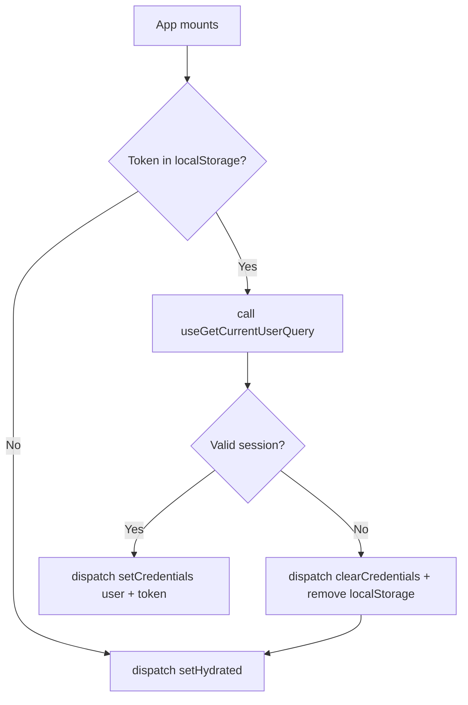
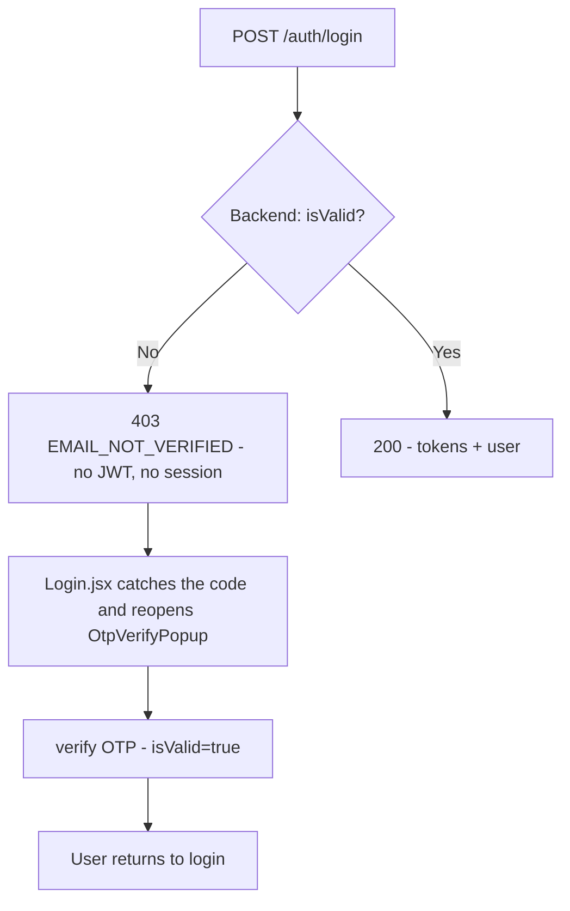
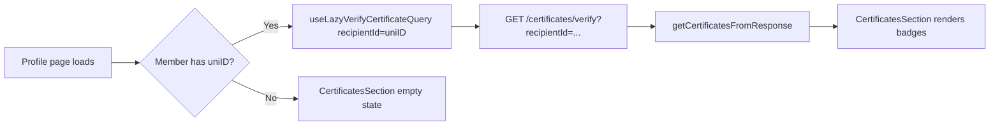
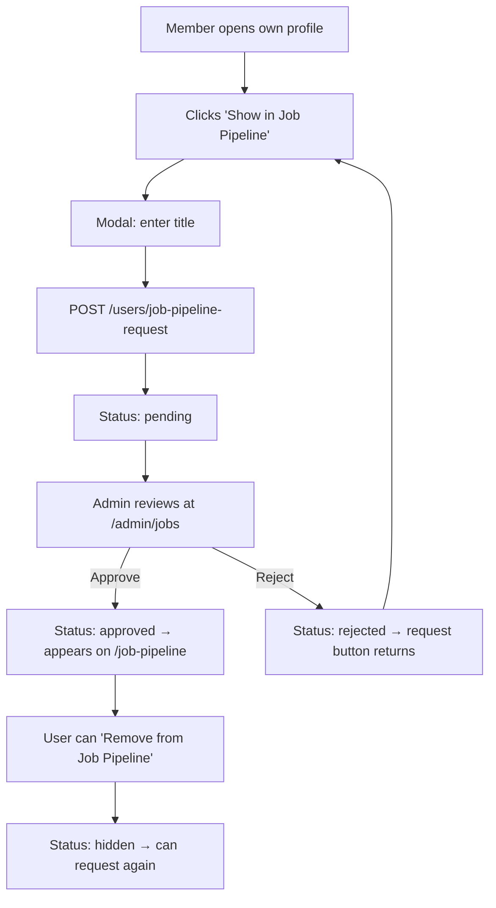
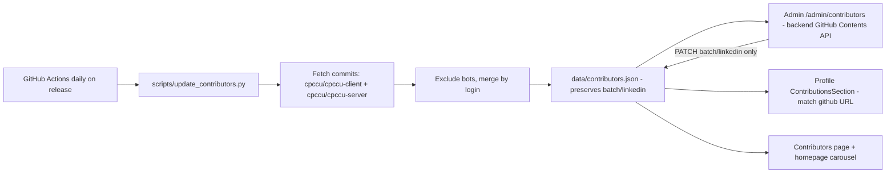
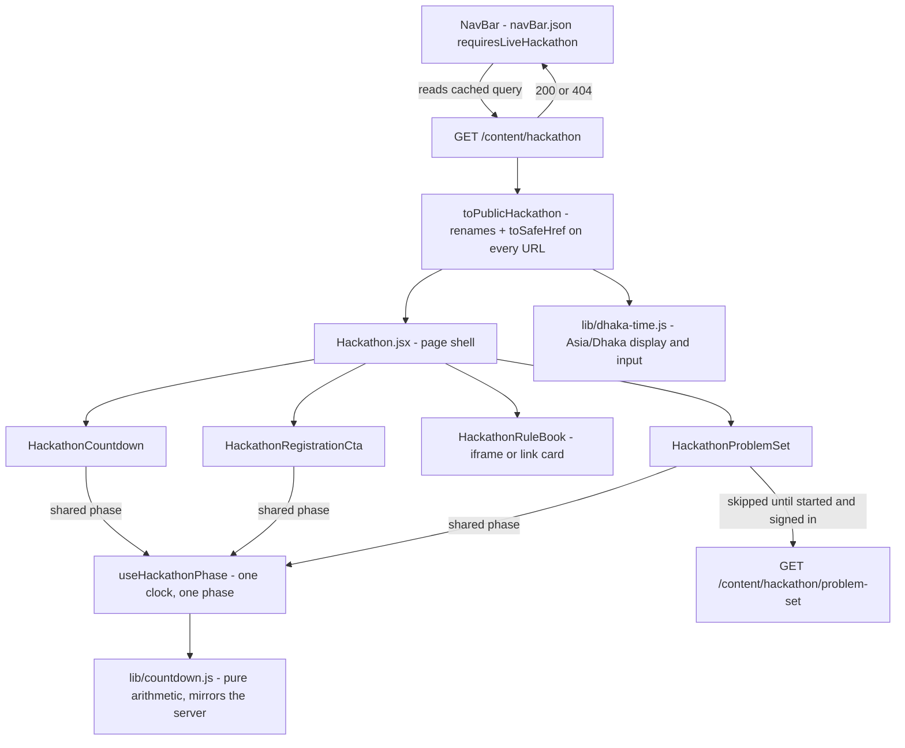

# CPCCU Frontend Architecture Documentation

This document describes the current architecture of the `cpccu-client` repository as it exists in production.

> **Rule of thumb:** when documentation and code disagree, **the code is correct**. This document is verified against the source tree.

> **Looking for the reasoning behind key decisions?** See [ADR.md](./ADR.md) — Architecture Decision Records covering deployment, certificates, roles, the profile system, the job pipeline, RTK Query, security headers, and auth.

> **Cross-repository note:** this document describes the frontend half of CPCCU. The system is completed by `cpccu-server` (Express + MongoDB API on Render) — see [`cpccu-server/docs/ARCHITECTURE.md`](https://github.com/cpccu/cpccu-server/blob/dev/docs/ARCHITECTURE.md) for the backend half, and [DEPLOYMENT.md](./DEPLOYMENT.md) for how the two connect.

## 1. Technology Stack

| Layer | Technology |
| --- | --- |
| Framework | Next.js 16 (App Router, `src/` directory) |
| Runtime UI | React 19 |
| Language | JavaScript (ES modules, JSX) |
| State Management | Redux Toolkit |
| Server State / Data Fetching | RTK Query |
| Styling | Tailwind CSS 4, Tailwind CSS Animate, Tailwind Merge |
| UI Component System | Radix UI primitives + `class-variance-authority` |
| Animation | Framer Motion |
| Icons | Font Awesome, Lucide React, React Icons |
| Validation | Zod |
| Date Handling | date-fns, React Day Picker |
| Charts | Recharts |
| Carousels | Embla Carousel React |
| Notifications | Sonner, SweetAlert2 |
| Command Palette | cmdk |
| OTP Input | input-otp |
| Image Crop | react-easy-crop |
| Upload | upload-js (Cloudinary) |
| Scroll | react-scroll, react-scroll-trigger |
| Panels | react-resizable-panels |
| Counters | react-countup |
| Spreadsheet Export | xlsx |
| Package Manager | npm / Bun |

## 2. Repository Layout

```
cpccu-client/
├── .github/workflows/       # update-contributors.yml — daily contributor sync
├── data/                    # Static JSON content sources (fallback data)
├── DOCUMENTATION/           # Project docs (this file, API docs, deployment, etc.)
├── lib/                     # Root-level shared utilities (cn.js)
├── public/                  # Static assets
├── scripts/                 # update_contributors.py
├── src/
│   ├── app/                 # Next.js App Router pages & layouts
│   ├── components/          # Feature and shared UI components
│   ├── Context/             # Scroll-based section contexts
│   ├── features/            # Redux slices + RTK Query endpoint modules
│   ├── hooks/               # use-admin-content, use-mobile, use-toast
│   ├── lib/                 # Utilities (roles, certificates, public-content, ...)
│   ├── proxy.ts             # Next.js 16 proxy (security headers)
│   └── services/            # RTK Query base API setup
```

## 3. Routing Architecture (App Router)

### 3.1 Root Shell

- Root layout `src/app/layout.jsx` imports `globals.css`, sets global metadata (`metadataBase` = `https://www.cpccu.club`), loads the Inria Sans Google Font, and wraps the app in `ProviderWrapper` (Redux Provider + auth hydration).
- `src/app/ScrollToTop.jsx` provides global scroll-to-top behavior.
- `src/app/not-found.jsx` renders the custom 404 page.

Nav visibility is data-driven from `data/global/navBar.json`, and some entries are **filtered at runtime**, not in the JSON. The `Hackathon` entry carries `requiresLiveHackathon: true`, which `NavBar.jsx` resolves by reading the cached `GET /content/hackathon` query: the entry is shown only on a `200`, and hidden while loading and on error. There is deliberately **no** separate `/content/hackathon/status` endpoint — that 200-vs-404 is the only bit the nav needs, and it is the same cache entry the `/hackathon` page reads, so clicking through costs zero extra requests.

### 3.2 Main Public Route Group (`(main)`)

- Shared shell in `src/app/(main)/layout.jsx`: `Header` → `NavBar` → children → `Footer` → `GoToTop`.

| Route | Page |
| --- | --- |
| `/` | Homepage |
| `/blog` | Blog listing |
| `/bootcamp-leaderboard` | Bootcamp leaderboard |
| `/certificate` | Certificate verification portal |
| `/certificate/[certificateId]` | Per-certificate detail page (SSR metadata) |
| `/committee` | Committee page |
| `/contact` | Contact page |
| `/contributors` | Contributors page |
| `/donators` | Donators page |
| `/event` | Event page |
| `/event/[eventId]` | Event detail page — the participation surface (window, register CTA, winners gallery; see §20) |
| `/event/[eventId]/register` | Event registration page (solo or team; see §20) |
| `/event/[eventId]/submit` | Event submission page (the one submission per registration; see §20) |
| `/gallery` | Gallery page |
| `/hackathon` | Hackathon page — countdown, details, registration CTA, rule book, problem set (see §19) |
| `/history` | Club history |
| `/job-pipeline` | Developer job pipeline |
| `/member` | Member directory |
| `/profile/[id]` | Public profile page |
| `/users/profile/[id]` | Legacy alias for the same profile page |

### 3.3 Auth and Utility Routes

| Route | Page |
| --- | --- |
| `/login` | Login page |
| `/signup` | Registration page with OTP verification |
| `/reset-password/[code]/[token]` | Password reset page |
| `/verify/[certificateId]` | Redirects to `/certificate/[certificateId]` |

### 3.4 Admin Routes (`/admin`)

- Client-side guard: each admin page imports `src/components/admin-layout.jsx`, which redirects unauthenticated users to `/login` once auth hydration completes, shows a loading state before hydration, and renders an "Admin access required" screen for non-admin roles (`admin`, `moderator`, `mentor`). (`src/app/admin/layout.jsx` is only a metadata pass-through; the actual guard lives in the `admin-layout` component.)
- Navigation is role-filtered in `src/components/admin-sidebar.jsx` (see the module table in §13).

| Route | Module |
| --- | --- |
| `/admin` | Dashboard |
| `/admin/members` | Members (incl. official role management) |
| `/admin/posts` | Posts |
| `/admin/messages` | Contact messages |
| `/admin/events` | Events |
| `/admin/gallery` | Gallery |
| `/admin/hackathon` | Hackathon (visibility toggle, rule book, problem set, CTA label, schedule) |
| `/admin/participation` | Event participation review (registration roster + submission queue; admin reads/writes, moderator reads) |
| `/admin/jobs` | Developer profiles / job pipeline |
| `/admin/alumni` | Alumni |
| `/admin/contributors` | Contributors |
| `/admin/donators` | Donators |
| `/admin/committees` | Committees |
| `/admin/certificates` | Certificates |
| `/admin/statistics` | Site statistics |
| `/admin/audit-logs` | Audit logs |
| `/admin/settings/account` | Account settings |
| `/admin/settings/system` | System settings |

## 4. State Management and Data Flow

### 4.1 Active Store Configuration

The active store is `src/app/redux/store.js`.

Registered reducers:

| Key | Source |
| --- | --- |
| `api` | `baseApi` RTK Query reducer |
| `publicApi` | public certificate API reducer |
| `auth` | auth slice |
| `certificate` | certificate slice |

Middleware: `baseApi.middleware`, `publicApi.middleware`. The serializable check is disabled.

> `src/app/redux/rootReducer.js` is **stale** (it imports `usersSlice`/`postsSlice` files that do not exist) and is **not** used by the active store.

### 4.2 Auth Hydration Flow

`src/app/redux/ProviderWrapper.js` performs hydration on app load:


```mermaid
flowchart TD
    A[App mounts] --> B{Token in localStorage?}
    B -- No --> C[dispatch setHydrated]
    B -- Yes --> D[call useGetCurrentUserQuery]
    D --> E{Valid session?}
    E -- Yes --> F[dispatch setCredentials user + token]
    E -- No --> G[dispatch clearCredentials + remove localStorage]
    G --> C
```

1. `AuthHydrator` reads the token from `localStorage`.
2. If a token exists, it calls `useGetCurrentUserQuery` to validate the session.
3. On success it dispatches `setCredentials` with the user and token.
4. On failure it dispatches `clearCredentials` and removes the `user`/`token` localStorage items.
5. `setHydrated` is dispatched in all cases to unblock auth-aware UI.

### 4.3 Slice Responsibilities

| Slice | File | Registered | Purpose |
| --- | --- | --- | --- |
| `auth` | `src/features/auth/authSlice.js` | ✅ | `user`, `token`, `loading`, `error`, `hydrated`; `setCredentials` / `clearCredentials` / `setHydrated`; localStorage persistence |
| `certificate` | `src/features/certificate/certificateSlise.js` | ✅ | Certificate search form state (`searchData`) and verification result (`result`); `setSearchData` / `setCertificateResult` / `clearCertificateResult` |
| `users` | `src/features/users/userSlice.js` | ❌ | Exists but **not registered** in the active store |
| `members` | `src/features/members/memberSlice.js` | ❌ | Exists but **not registered** in the active store |
| `posts` | `src/features/posts/postSlice.js` | ❌ | Exists but **not registered** in the active store |

### 4.4 RTK Query API Layer

- `src/services/baseApi.js` — the single `createApi` instance (reducer path `api`). Feature modules inject endpoints via `baseApi.injectEndpoints()`.
- `src/features/certificate/certificateApi.js` also defines `publicApi` — a separate `createApi` instance (reducer path `publicApi`) without auth headers for public certificate verification.

**Tag types** (cache invalidation):

```
Auth, Users, Posts, Projects, PublicContent,
AdminOverview, AdminMembers, AdminContent, AdminContributors,
AdminStatistics, AdminCertificates, AdminSystemSettings, AdminRoles,
Participation
```

> ⚠️ Code quirk: `memberApi.js` provides a `Members` tag, but `Members` is **not** declared in `baseApi.tagTypes`.

**Endpoint injection modules:**

| Module | File | Covers |
| --- | --- | --- |
| `authApi` | `features/auth/authApi.js` | login, register, send-otp, otp-verify, current user, logout, password reset |
| `userApi` | `features/users/userApi.js` | user CRUD, image upload, job pipeline request/remove, password change, account deletion, projects CRUD |
| `memberApi` | `features/members/memberApi.js` | public member directory |
| `certificateApi` | `features/certificate/certificateApi.js` | certificate verify/search, stats, recent + public verify |
| `contentApi` | `features/content/contentApi.js` | public content + statistics + hackathon + hackathon problem set |
| `contactApi` | `features/contact/contactApi.js` | contact form submission |
| `adminApi` | `features/admin/adminApi.js` | admin overview, members, content, roles, statistics, system settings, certificates, image upload |
| `participationApi` | `features/participation/participationApi.js` | event participation — public window + winners, member registrations/submissions, member search, admin review lists + review decision (see §20) |

### 4.5 Direct Fetch (non-RTK Query)

| Location | Purpose |
| --- | --- |
| `src/components/HOME/VisitorCounter.jsx` | Visitor count fetch + increment |
| `src/components/BOOTCAMPLEADERBOARD/BootcampLeaderboard.jsx` | Bootcamp leaderboard data |
| `src/lib/certificate-metadata.js` | Server-side fetch for certificate detail page metadata |

## 5. Security Middleware (`src/proxy.ts`)

`src/proxy.ts` implements Next.js 16's proxy (middleware) convention. It exports `proxy(request)` and applies security headers to every route except `_next/static` and `_next/image` (via `config.matcher`):

- **Content-Security-Policy** — production only; restricts script/style/img/connect/font sources, and pins `frame-src` to `'self' https://drive.google.com https://docs.google.com` (see §19 and [SECURITY.md](./SECURITY.md#3-transport--headers)).
- **X-Content-Type-Options** — `nosniff`
- **Referrer-Policy** — `strict-origin-when-cross-origin`
- **Permissions-Policy** — disables camera, microphone, geolocation, usb, payment, accelerometer, gyroscope, magnetometer
- **X-Frame-Options** — `DENY`
- **Cross-Origin-Embedder-Policy** — `unsafe-none`
- **Cross-Origin-Opener-Policy** — `same-origin`
- **Cross-Origin-Resource-Policy** — `same-origin`
- **Strict-Transport-Security** — HSTS when the host is not `localhost`/`127.0.0.1`/`0.0.0.0`

## 6. Authentication

The frontend uses a **single access-token** JWT flow (there is no refresh-token or Google OAuth flow on the frontend):

1. **Login** (`POST /auth/login`) returns `{ user, token }`; the token is stored in `localStorage` (`token`) and the user in `localStorage` (`user`). An **unverified** account gets `403 EMAIL_NOT_VERIFIED` — no token is stored and the OTP popup reopens.
2. **Requests** — `baseApi` attaches `Authorization: Bearer <token>` when a token exists and sets `credentials: 'include'` for cookie-based backend flows.
3. **Session validation** — `ProviderWrapper` re-validates the token on app load via `GET /users/user`.
4. **Logout** — `GET /auth/logout` + `clearCredentials` (removes localStorage).
5. **Protected routes** — the admin layout is guarded client-side for roles `admin`, `moderator`, `mentor`. Non-admin users see "Admin access required".

Registration uses **email OTP verification**: `POST /auth/send-otp` → `POST /auth/verify-registration`, handled by `OtpVerifyPopup` after `POST /auth/register`.

**Email verification is enforced by the backend** — the frontend cannot obtain a session for an unverified account:


```mermaid
flowchart TD
    A[POST /auth/login] --> B{Backend: isValid?}
    B -- No --> C[403 EMAIL_NOT_VERIFIED - no JWT, no session]
    B -- Yes --> D[200 - tokens + user]
    C --> E[Login.jsx catches the code and reopens OtpVerifyPopup]
    E --> F[verify OTP - isValid=true]
    F --> G[User returns to login]
```

- `Login.jsx` (`src/components/LOGINSIGNUP/Login.jsx`) inspects the error payload for the `EMAIL_NOT_VERIFIED` code, opens the existing OTP verification popup, and stores **no** credentials.
- `OtpVerifyPopup` (6-char input, 60s resend countdown) calls `sendOtp` (resend) and `otpVerify` (`POST /auth/verify-registration`). On success it asks the user to log in again.

Password reset: `GET /auth/reset-link/:email` sends the reset email; `PATCH /auth/reset-password` (with `code` + `token` from the URL) completes it. Passwords are validated with `src/lib/password-validation.js`.

## 7. Profile System

Route: `/profile/[id]` (page in `src/app/(main)/profile/[id]/page.jsx`, layout `src/components/Layout/Profile.jsx`).

### 7.1 Page Data Flow

- The page reads the current user from Redux; if the requested `id` matches the logged-in user (`_id` or `uniID`) it renders the local user, otherwise it fetches the public user via `useFetchUserByIdQuery` (`GET /users/user/:id`).
- Skeleton loading, "Unable to Load Profile" (error) and "Profile Not Found" states are handled in the page.
- Ownership (`isOwnProfile`) gates edit mode, image upload, project CRUD, and job pipeline controls.

### 7.2 Sections (active components in `src/components/PROFILE/`)

| Section | Component | Purpose |
| --- | --- | --- |
| Hero | `ProfileHero.jsx` | Avatar, cover band, official-role badge, department/batch/ID/member-since, socials, owner actions (Edit, Job Pipeline, Logout) |
| About | `AboutSection.jsx` | Biography / about text |
| Member Info | `MemberInfoSection.jsx` | Contact + academic details |
| Skills | `SkillsSection.jsx` | Skills with `skillName` + `experience` (grouped) |
| Projects | `ProjectsSection.jsx` | Portfolio projects (owner can CRUD/reorder) |
| Certificates | `CertificatesSection.jsx` | Dynamically fetched certificates (see §8) |
| Contributions | `ContributionsSection.jsx` | GitHub contributor widget (see §11) |
| Contact | `ContactSection.jsx` | Contact links |
| Quick Stats | `QuickStats.jsx` | Animated counters (projects, certificates, contributions) |
| Shared | `SectionCard.jsx` / `EmptyState.jsx` | Section wrapper + empty state |
| Utility | `AnimatedCounter.jsx`, `BrandIcons.jsx` | Counter animation + brand icons |
| Image | `ImageUploadModal.jsx`, `ProfileImageCropModal.jsx` | Upload + react-easy-crop flow |

> Legacy/unused profile components (`ProfileCard`, `ProfileDetails`, `ProfileID`, `ProfileBlog`, `Profile_Blog_Modal`, `ProfileNotFound`, `AchievementBadges`) remain in the folder but are only referenced by the unused `src/components/Layout/Profile1.jsx`.

### 7.3 Owner Permissions

- Edit toggle → inline form updates (`PATCH users/userInfo-update`).
- Avatar upload → `PATCH users/user/upload-image/:key` (crop via `src/lib/cropImage.js`).
- Skills add/remove/update.
- Projects create/update/delete.
- Job pipeline request/remove (see §9).

### 7.4 Public Profile Permissions

Visitors can view all sections; owner-only controls (edit, image upload, project management, job pipeline actions, logout) are hidden. Certificates and projects are fetched with public endpoints.

## 8. Certificate System

### 8.1 Verification Portal

- `/certificate` — search form (`VerifyForm`), stats (`CertificateStats`), recent certificates (`RecentCertificates`).
- `/certificate/[certificateId]` — same page pre-filled with the ID; `generateMetadata` calls `getCertificateMetadata` (server-side fetch of `GET /certificates/verify?certificateId=...`).
- `/verify/[certificateId]` — legacy route that redirects to `/certificate/[certificateId]`.

### 8.2 APIs

| Endpoint | API | Auth |
| --- | --- | --- |
| `GET /certificates/verify?certificateId=&recipientName=&recipientId=` | `certificateApi.verifyCertificate` | No (public — backend attaches no auth requirement; a token is sent only if one exists) |
| `GET /certificates/stats` | `certificateApi.getCertificateStats` | No (public) |
| `GET /certificates/recent` | `certificateApi.getRecentCertificates` | No (public) |
| `GET /verify/:certificateId` | `publicApi.verifyCertificatePublic` | No |

Search behavior: `certificateId` exact match; `recipientName` partial case-insensitive; `recipientId` case-insensitive. Name/ID searches can return multiple certificates.

### 8.3 How the Profile Integrates with Certificates


```mermaid
flowchart LR
    A[Profile page loads] --> B{Member has uniID?}
    B -- Yes --> C[useLazyVerifyCertificateQuery recipientId=uniID]
    C --> D[GET /certificates/verify?recipientId=...]
    D --> E[getCertificatesFromResponse]
    E --> F[CertificatesSection renders badges]
    B -- No --> G[CertificatesSection empty state]
```

Key facts:

- Certificates are **NOT stored in the user profile**.
- They are **fetched dynamically** from the certificate system using the member's **student ID** (`uniID`).
- The existing certificate system (backend `Certificate` collection) is the **single source of truth**.
- The profile only displays them; admins issue/verify certificates through `/admin/certificates`.

### 8.4 Utilities (`src/lib/certificates/`)

| File | Responsibility |
| --- | --- |
| `parser.js` | `getCertificatesFromResponse` — safely extracts an array from any response shape |
| `sorting.js` | `sortCertificatesNewest`, `sortCertificatesOldest`, `sortByIssueDate` |
| `badges.js` | Badge labels/colors/icons by certificate type (`winner`, `runner-up`, `participation`, ...) |
| `permissions.js` | Stubs preparing download/share/edit/delete capability checks (all return `false`) |
| `index.js` | Re-exports |

## 9. Job Pipeline

Public route `/job-pipeline` (component `src/components/Layout/JobPipeline.jsx`) reads approved developer profiles via `contentApi` (`GET /content/profiles`) and falls back to `data/job-pipeline/Info.json` on error.

Complete workflow:


```mermaid
flowchart TD
    A[Member opens own profile] --> B[Clicks 'Show in Job Pipeline']
    B --> C[Modal: enter title]
    C --> D[POST /users/job-pipeline-request]
    D --> E[Status: pending]
    E --> F[Admin reviews at /admin/jobs]
    F -->|Approve| G[Status: approved → appears on /job-pipeline]
    F -->|Reject| H[Status: rejected → request button returns]
    G --> I[User can 'Remove from Job Pipeline']
    I --> J[Status: hidden → can request again]
    H --> B
```

| State | User-visible behavior |
| --- | --- |
| `hidden` (default) | "Show in Job Pipeline" button |
| `pending` | "Requested for Job Pipeline" (disabled) |
| `approved` | "Shown in Job Pipeline" + "Remove from Job Pipeline" |
| `rejected` | Request button returns; rejection reason stored (`jobPipelineRejectionReason`) |

Admin module: `/admin/jobs` (`jobs-content.jsx`) supports approve / reject / revert / remove actions against `DeveloperProfile` records.

## 10. Dynamic Role System

### 10.1 Two Kinds of Roles

| Kind | Purpose | Managed in | Example |
| --- | --- | --- | --- |
| **System roles** | Backend permissions | Backend middleware / admin layout | `admin`, `moderator`, `mentor`, `member` |
| **Official roles** | Display-only CPCCU position titles | `/admin/members` (role dropdown) | President, Vice President, General Secretary, Treasurer |

Official roles are stored in the `Role` collection and displayed on member profiles (badge + emoji icon). System roles control access and are never shown as official titles (`getDisplayRole` returns `Member` for system roles).

### 10.2 Admin Role Management

Injected in `adminApi.js`:

| Endpoint | Purpose |
| --- | --- |
| `GET /admin/roles` | List all roles |
| `GET /admin/roles/active` | List only active roles |
| `POST /admin/roles` | Create a role |
| `PATCH /admin/roles/:id` | Update a role |
| `PATCH /admin/roles/:id/toggle` | Toggle active/inactive |

Tag: `AdminRoles`. The role dropdown and creation UI live inside `members-content.jsx`.

### 10.3 `src/lib/roles.js`

- `DEFAULT_CPCCU_ROLES` — canonical official role list (fallback)
- `normalizeRole(name)` — title-case normalization
- `isOfficialRole(role)` — membership check against the canonical list
- `getDisplayRole(officialRole)` — display-safe name (system roles → `Member`)
- `roleIcon(role)` — emoji icon mapping
- `roleBadgeColor(role)` — Tailwind badge color classes
- `sortRoles(roles)` — alphabetical sort

## 11. Contributors


```mermaid
flowchart LR
    A[GitHub Actions daily on release] --> B[scripts/update_contributors.py]
    B --> C[Fetch commits: cpccu/cpccu-client + cpccu/cpccu-server]
    C --> D[Exclude bots, merge by login]
    D --> E[data/contributors.json - preserves batch/linkedin]
    E --> F[Admin /admin/contributors - backend GitHub Contents API]
    F -->|PATCH batch/linkedin only| E
    E --> G[Profile ContributionsSection - match github URL]
    E --> H[Contributors page + homepage carousel]
```

- **Single source of truth:** `data/contributors.json` in this repo (`release` branch). The daily GitHub Action regenerates it from commits in **both** `cpccu/cpccu-client` and `cpccu/cpccu-server`, excluding bots and preserving the manually-managed fields (`name`, `role`, `department`, `batch`, `linkedin`).
- **Admin interaction (GitHub-synced, not generic content):** the `/admin/contributors` page (`src/components/contributors-content.jsx`) calls `GET /admin/contributors` (backend reads the JSON live from GitHub) and `PATCH /admin/contributors/:githubUsername` to write back **only `batch` and `linkedin`**. The role is fixed as "Contributor" (read-only), and GitHub info (name, username, avatar, commit count) is auto-synced. The backend requires `CONTRIBUTOR_GITHUB_TOKEN`; without it the page falls back to the bundled JSON with a warning banner.
- `src/lib/public-content.js` provides `extractGithubUsername`, `findContributorByGithub`, and `parseContributionInfo`; `ContributionsSection` matches the member's GitHub URL to a contributor record and renders rank/commits.
- The **public** Contributors page (`src/components/CONTRIBUTORS/ContributorsPage.jsx`) reads `GET /content/contributors` (legacy DB-backed resource) and falls back to `data/contributors.json` when the collection is empty or the request fails. Because the migration deliberately excluded `contributors.json`, the JSON is what actually renders.

## 12. Projects

- Data lives in the backend `Project` collection (keyed to users); projects are **not** stored in the profile document.
- Endpoints (injected via `userApi.js`): `GET /projects`, `POST /projects`, `PATCH /projects/:id`, `DELETE /projects/:id`, `GET /projects/user/:userId` (public).
- Tag: `Projects`.
- Profile usage: `getProjects` (owner) or `getPublicProjects` (visitor); `ProjectsSection` renders cards; owner edit mode adds create/update/delete.

## 13. Admin Panel Modules

| Module | Content source | Notes |
| --- | --- | --- |
| Dashboard | `GET /admin/overview` | Live stats + Recharts (area, bar, pie) |
| Members | `GET/POST/PATCH/DELETE /admin/members` | Approval (`memberStatus` — see §20.5), status, official role assignment |
| Posts | Generic content `posts` | Title, content, cover image, status |
| Events | Generic content `events` | Date phases, rewards, rules, buttons. Excludes hackathon rows from the public list |
| Hackathon | Generic content `events` (same endpoint, no new admin route) | Visibility toggle, rule book, problem set, CTA label, Dhaka-time schedule |
| Participation | `GET /admin/participation/{registrations,submissions}` + `PATCH /admin/participation/submissions/:id` | Registration roster + submission review queue (per event), shortlist/reject with `reviewNote`. Admin reads+writes; moderator reads; the review action is gated on role in the component |
| Gallery | Generic content `gallery` + `gallery-events` | Image upload, event grouping |
| Certificates | `GET/POST/PATCH/DELETE /admin/certificates` | Issue, bulk issue, delete |
| Jobs | `GET /admin/content/profiles` | Developer profile review |
| Alumni | Generic content `alumni` | Alumni records with job history |
| Contributors | `GET/PATCH /admin/contributors` (GitHub Contents API) | GitHub-synced records — read-only GitHub fields, edit `batch`/`linkedin`; role fixed as Contributor |
| Donators | Generic content `donators` | Donator recognition |
| Committees | Generic content `committees` | Running/previous committees |
| Statistics | `GET /admin/statistics` | Live stats aggregated from real data sources |
| Audit Logs | Generic content `audit-logs` (read-only) | Admin action log |
| Messages | Generic content `messages` | Contact message triage |
| Account Settings | `userApi` + auth | Profile + password |
| System Settings | `GET/PATCH /admin/system-settings` | Site metadata, maintenance, appearance |

See [CPCCU_Admin_Panel_Implementation_Documentation.md](./CPCCU_Admin_Panel_Implementation_Documentation.md) for full module details.

## 14. Utilities (`src/lib/`)

| File | Responsibility |
| --- | --- |
| `roles.js` | Official role helpers (see §10.3) |
| `countdown.js` | Pure hackathon countdown arithmetic: `getCountdownPhase`, `getRemainingMs`, `splitDuration`, `getCountdownTarget`, `hasHackathonStarted` (see §19) |
| `hackathon.js` | Client mirror of the server URL policy (`isSafeHttpUrl`, `toSafeHref`) + `deriveEmbeddableUrl` (see §19) |
| `participation.js` | Event participation helpers (see §20): the client mirror of the server's window resolver (`resolveWindowAction`, `resolveTeamRules`, `resolveRegistrationTarget`, `resolveSubmissionTarget`), submission state (`isSubmissionEditable`, `describeSubmissionStatus`), form normalizers (`normalizeTeamName`, `normalizeTechnologies`, `parseTechnologies`), `findActiveRegistration`, and `getParticipationErrorMessage` |
| `participation-routes.js` | `IS_EVENT_ID` — the event-id shape guard shared by the three participation pages |
| `dhaka-time.js` | Asia/Dhaka conversion and formatting for admin-entered and displayed times (see §19) |
| `certificates/` | Certificate parsing/sorting/badges/permissions (see §8.4) |
| `certificates-data.js` | Static demo certificate dataset (`CERTIFICATES`, `CONTEST_NAMES`, `STATS`) |
| `public-content.js` | Public content mappers (`chooseLiveItems`, `toPublicContributor`, `toPublicEvent`, `groupGalleryItemsByEvent`, ...) + GitHub username extraction |
| `certificate-metadata.js` | Server-side metadata generation for `/certificate/[certificateId]` |
| `id-validation.js` | Student ID validation (`isValidStudentId`, `normalizeStudentId`, scientific-notation detection) |
| `password-validation.js` | Password strength rules + `validatePassword` |
| `format-date.js` | `formatDate` (UTC-stable date formatting) |
| `alerts.js` | SweetAlert2 helpers (`showSuccessAlert`, `showErrorAlert`, `showDeleteConfirm`, `showInfoAlert`, `showConfirmAlert`) |
| `cropImage.js` | `getCroppedImg` — canvas-based image crop for avatars |
| `demo-data.js` | Demo datasets (dashboard, members, events, gallery, posts, certificates, contributors, ...) — used only where live data is unavailable |
| `types.js` | Empty (placeholder) |
| `utils.js` | `cn()` — tailwind-merge + clsx |

## 15. Hooks

| Hook | Purpose |
| --- | --- |
| `useAdminContent(resource, fallback)` | Local CRUD state for generic admin content tables with RTK Query + fallback JSON |
| `useHackathonPhase({ startAt, endAt, serverPhase })` | The **single** source of the ticking hackathon phase for the countdown, the registration CTA and the problem-set panel (see §19) |
| `useIsMobile()` | Mobile breakpoint detection (768px) via `matchMedia` |
| `useToast()` / `toast()` | Global toast system (limit 1, reducer-based) |

## 16. Context Providers (`src/Context/`)

- `BlogScroll` — Blog section navigation
- `ContactScroll` — Contact section navigation
- `EventScroll` — Event section navigation
- `GalleryScroll` — Gallery section navigation
- `OurMessionScroll` — Home mission section navigation

## 17. Environment Variables

| Variable | Required | Used in |
| --- | --- | --- |
| `NEXT_PUBLIC_API_BASE_URL` | Yes (prod) | `baseApi.js`, `certificateApi.js`, `certificate-metadata.js`, `VisitorCounter.jsx`, `BootcampLeaderboard.jsx` |

⚠️ **`NEXT_PUBLIC_*` is inlined at build time**, so a set-but-wrong value silently wins in production and the `|| 'http://localhost:5000/api/v1'` fallback in `baseApi.js:4` never gets a chance to apply. The current `.env` deliberately leaves it unset and `.env.sample` carries it commented. If you do set it, set it for the build, not for the server.

> ⚠️ **Any component that resolves its own base URL must use an absolute fallback.** `VisitorCounter.jsx` bypasses RTK Query, so it does not inherit `baseApi.js`'s fallback and has to resolve one itself — it now uses `http://localhost:5000`, matching `baseApi.js`. A `""` fallback silently degrades to the same-origin relative path `/api/visitor`, which Next does not serve (404), and the failure surfaces only as "Failed to fetch" in the console. This is the actual rule behind the fix; the file's own comment block records it.

> `GOOGLE_SHEETS_API_KEY` and `BOOTCAMP_SHEET_ID` are **backend** variables referenced only in the leaderboard's error hint. `NODE_ENV` is used by `proxy.ts` to enable production-only headers.

See [DEPLOYMENT.md](./DEPLOYMENT.md) for production configuration.

## 19. Hackathon

Two routes, one data shape, and four client-side modules whose whole job is to keep the two from disagreeing.


```mermaid
flowchart TD
    A[NavBar - navBar.json requiresLiveHackathon] -->|reads cached query| B[GET /content/hackathon]
    B -->|200 or 404| A
    B --> C[toPublicHackathon - renames + toSafeHref on every URL]
    C --> D[Hackathon.jsx - page shell]
    D --> E[HackathonCountdown]
    D --> F[HackathonRegistrationCta]
    D --> G[HackathonRuleBook - iframe or link card]
    D --> H[HackathonProblemSet]
    E & F & H -->|shared phase| I[useHackathonPhase - one clock, one phase]
    I --> J[lib/countdown.js - pure arithmetic, mirrors the server]
    H -->|skipped until started and signed in| K[GET /content/hackathon/problem-set]
    C --> L[lib/dhaka-time.js - Asia/Dhaka display and input]
```

### 19.1 Data flow

- `GET /content/hackathon` (no auth) is the **only** public read. `toPublicHackathon` (`src/lib/public-content.js`) renames the server's model names to UI names (`location → venue`, `registrationLink → registrationUrl`, `date/endDate → startAt/endAt`) and passes **every** URL through `toSafeHref`.
- `toPublicHackathon` deliberately **does not** apply `chooseLiveItems`. That primitive is array-shaped (it reads `response.data` and `.map()`s it) and its fallback semantics — "show demo data on error" — are wrong for a page whose entire content is one record. Loading / error / empty are three explicit branches, following `JobPipeline.jsx`.
- `toPublicEvent` also gained `isHackathon: event.type === 'hackathon'` and routes `btnLink` / `btnLink1` through the same `toSafeHref`. The flag is the one place the client decides "is this row a hackathon?"; `NoticeSection` and `EventLayout` both filter on it. The server already omits hackathons from the events list, so the client filter is a no-op in practice — deliberately, as the forward-compatible shape.

### 19.2 The phase, and why it is derived twice

The server resolves `phase` once at request time and ships it. `lib/countdown.js` mirrors that mapping client-side (`getCountdownPhase`, **inclusive** boundaries: `now === start` and `now === end` are both `live`) so a tab left open across a boundary updates without a refetch — no timer invalidates the `PublicContent: 'hackathon'` tag, so a refetch would mean a hard refresh.

`useHackathonPhase` is the single hook that owns the clock (1 s interval) and the single source of the phase for the countdown, the CTA and the problem-set panel. It returns `{ now, phase }` where `now` is **`null` before mount**: reading the clock during render would make the first client render differ from the server's HTML (a hydration mismatch), so the server's verdict is used verbatim until the first tick. Components needing a neutral pre-mount state check `now === null`.

`problemSetAvailable` comes from the server and is **advisory**. The client ANDs it with `hasHackathonStarted({ date: startAt })` — deliberately **not** with `phase === 'live' || 'ended'`, because the server's release predicate consults `date` only. A record with a valid start and a missing/inverted end resolves to `phase === 'unannounced'` while the server would still answer `200`; keying off `phase` produced a permanently dead button. The client query is `skip`ped entirely before release, so a signed-in visitor cannot even probe the endpoint.

### 19.3 The rule book: iframe or link card

`deriveEmbeddableUrl` (`src/lib/hackathon.js`) rewrites Google Drive `/view`, `/open?id=`, `uc?export=download&id=`, and Google Docs `gview` / `/document/d/<ID>/edit` into their embeddable preview forms, and returns `null` for any other host. `null` is a meaningful return, not a failure: `HackathonRuleBook` must then render an **"open in a new tab" card**, never `<iframe src={originalUrl}>`.

Two properties make the coupling with the CSP hold:

- The host allow-list is `drive.google.com` / `docs.google.com` only. Anything else in an iframe inside our own origin is a phishing / UI-redressing surface, and most document hosts send `X-Frame-Options: DENY` anyway.
- **Every returned URL is rebuilt on a bare, canonical host** — never passed through verbatim. A `www.` prefix is stripped for the comparison *and* for the emitted `src`, because CSP host matching is exact and `frame-src` lists the non-`www.` form. Passing the admin's href through would work under `next dev` (no CSP) and render a silently blank frame in production.

⚠️ **The CSP `frame-src` list and `EMBED_ALLOWED_HOSTS` are coupled on purpose. Add a host to one and you must add it to the other.** See [ADR-017](./ADR.md).

### 19.4 Admin page

`/admin/hackathon` (`src/app/admin/hackathon/page.jsx` + `src/components/hackathon-content.jsx`) reads and writes the **same** `/admin/content/events` records. There is no new backend route; the sidebar entry therefore carries the identical `roles: ['admin', 'moderator']` list as Events, and the page inherits the events authorisation.

Its "current hackathon" lookup is a deliberate **mirror** of the server's `currentHackathonQuery`. If the two rules differ, the admin would be editing a record the public site is not showing — so any change to the server's selection rule must be made here in the same commit.

Schedule input uses `datetime-local`, which yields a naive wall-clock string. It is interpreted as **Dhaka time** via `utcIsoFromDhakaInput` (explicit `+06:00`; Dhaka has observed UTC+6 with no DST since 2009), so the stored instant does not depend on the admin's device timezone. `events-content.jsx:133` still uses `new Date(value).toISOString()`, which interprets the input in the *browser's* zone — correct for a Dhaka admin, silently wrong for one abroad. That is left alone deliberately: changing it would rewrite the stored instant of every historical event.

### 19.5 Timezone handling

`lib/dhaka-time.js` is the only place that converts between the server's UTC ISO strings and Dhaka wall-clock. It is a dedicated module because two existing helpers are both wrong for this feature and were deliberately not reused: `lib/format-date.js` (its docstring claims UTC determinism but it formats a browser-local `Date`), and raw `new Date(datetimeLocalValue).toISOString()`. Both are reported, not fixed — changing either would alter every date on the public site or every historical event's stored instant, which is far outside a hackathon change.

---

## 20. Event Participation

Three member pages, one admin review panel, and a client-side mirror of the server's window resolver whose whole job is to explain *why* an action is unavailable. The backend half (routes, models, indexes, the approval gate) is in [`cpccu-server/docs/ARCHITECTURE.md`](https://github.com/cpccu/cpccu-server/blob/dev/docs/ARCHITECTURE.md) → *Event Participation*; this section is the client half. The RTK Query bindings and their tag scheme are in [API Documentation](./API_DOCUMENTATION.md#13-event-participation-participationapi).

### 20.1 The surfaces

| Route | Page file | Component |
| --- | --- | --- |
| `/event/[eventId]` | `src/app/(main)/event/[eventId]/page.jsx` | `components/PARTICIPATION/EventDetail.jsx` — the event page, now carrying the participation section (`EventParticipationSection`), the register CTA and the winners gallery (`EventWinnersGallery`) |
| `/event/[eventId]/register` | `.../register/page.jsx` | `EventRegistrationRoute.jsx` → `EventRegistrationForm.jsx` — solo or team registration |
| `/event/[eventId]/submit` | `.../submit/page.jsx` | `EventSubmissionRoute.jsx` → `EventSubmissionForm.jsx` — the one submission per registration |

All three pages validate the `eventId` with `IS_EVENT_ID` (`src/lib/participation-routes.js`) and call `notFound()` on a malformed id. The shared chrome is `ParticipationShell.jsx`; `ParticipationSignInPrompt.jsx` is the signed-out state. `MemberPicker.jsx` is the co-member type-ahead.

### 20.2 The window, resolved twice (on purpose)

`src/lib/participation.js` is the client's counterpart to the server's `resolveEventParticipationWindow`. It would be tempting to trust the server's `open` boolean and skip this layer — correct for security (every write path re-resolves the window server-side, so a forged `open` buys an attacker nothing) but it would leave the UI unable to say *why* an action is unavailable. A participant who arrives an hour after the deadline does not need "closed"; they need "registration closed on 4 March", and that sentence requires the deadline, which requires re-deriving the state from the same two inputs the server uses.

Exports: `resolveWindowAction` (with `ACTION_STATES`), `resolveTeamRules` (min/max team size), `resolveRegistrationTarget` / `resolveSubmissionTarget` (act in-app vs. follow an external URL), `isSubmissionEditable` (only while `status === 'submitted'`), `describeSubmissionStatus`, the form normalizers (`normalizeTeamName`, `normalizeTechnologies`, `parseTechnologies`), `findActiveRegistration` (newest non-withdrawn registration for an event — withdrawn ones are deliberately excluded here rather than at each call site, because forgetting it shows "You are registered" for a registration the member withdrew), and `getParticipationErrorMessage` (see [API Documentation §13.5](./API_DOCUMENTATION.md#135-error-messages--getparticipationerrormessage)).

### 20.3 The registration and submission pages

- **Register** — solo by default (the member's own name, no team name field); adding `memberIds` (student IDs, via `MemberPicker`) makes it a team and requires a name. The form's rules (min/max size, deadline, naming) come from `resolveTeamRules` + `resolveWindowAction`, and the server re-checks all of them.
- **Submit** — `EventSubmissionRoute` resolves *which registration* the caller holds for the event with `GET /me/registrations` + `findActiveRegistration` before showing the form; a member with no live registration is told so rather than shown a form that would 409. The form disables itself via `isSubmissionEditable` once a decision exists — there is no resubmit affordance, because the backend makes a second submission structurally impossible.

### 20.4 The admin review panel

`/admin/participation` (`src/app/admin/participation/page.jsx`) loads `ParticipationContent` (`src/components/participation-content.jsx`) through `next/dynamic` with `TablePageSkeleton` — matching every other admin page, so the large client component with its three RTK Query hooks stays out of the bundle of every *other* admin route. `ssr: false` is deliberately **not** set (the component reads the Redux store that `ProviderWrapper` hydrates before children paint, and a lone `ssr: false` would make this the only admin page whose shell renders differently on first paint).

The **role gate is in the component, not the page**: `AdminLayout` admits `admin`/`moderator`/`mentor`, and the data is read-available to admins and moderators only. Adding a second gate in the page file would be a second rule that could disagree with the one in `ParticipationContent`. The sidebar entry (`admin-sidebar.jsx`) carries `roles: ['admin', 'moderator']` with the three-endpoint matrix recorded in a comment beside it, and `admin-layout.jsx` adds the breadcrumb label.

### 20.5 The members approval UI (`members-content.jsx`)

The Members admin table gained a **second** status column, and the two columns are two different gates — the UI mirrors decision 11 (`isValid` vs `memberStatus` are independent):

| Column | Accessor | Meaning |
| --- | --- | --- |
| **Status** | `status` (derived `isValid ? 'active' : 'pending'`) | Email verification — the *login* gate |
| **Membership** | `memberStatus` (`pending`/`approved`/`rejected`, styled success/warning/destructive) | The *event-registration* gate |

Approve / Reject dropdown items (and the bulk-approve action) send `updateAdminMember({ id, memberStatus: 'approved' | 'rejected' })` — **only** `memberStatus`, which is also the only field a moderator may send (see [API Documentation §8.2](./API_DOCUMENTATION.md#82-members) and the server's `isMemberStatusUpdate` exception). Approve is offered while `memberStatus === 'pending'`; Reject while it is anything but `'rejected'`.

---

## 18. Current Notes and Inconsistencies

- The certificate slice filename is `certificateSlise.js` (typo, wired and working).
- `src/features/posts/postApi.js` is empty; posts use the generic admin content API.
- `src/app/redux/rootReducer.js` is stale and not used (imports non-existent files).
- `userSlice.js`, `memberSlice.js`, `postSlice.js` are not registered in the store.
- `memberApi.js` provides a `Members` tag that is not declared in `baseApi.tagTypes`.
- Several endpoint URLs in `userApi.js` omit the leading `/` (functional due to `fetchBaseQuery` resolution).
- `userApi.js` defines `createUser` (`POST /users/user`) and `deleteUser` (`DELETE /users/:id`) and `memberApi.js` defines `fetchMemberById` (`GET /users/member/:id`) — **none of these have a matching backend route**; they are unused/dead client definitions.
- `GET /auth/refresh-token` exists on the backend but the frontend never calls it — the frontend has no refresh-token flow (sessions rely on the access token + backend cookie renewal).
- `src/components/ADMIN/AdminPanel.jsx`, `src/components/Layout/Profile1.jsx`, and the legacy `PROFILE` components (`ProfileCard`, `ProfileDetails`, `ProfileID`, `ProfileBlog`, `Profile_Blog_Modal`, `ProfileNotFound`) are unused code kept in the tree.
- There are two `ui/` folders (`src/components/ui/` and `src/components/CERTIFICATE/ui/`) with duplicated shadcn-style components.
- `generateCertificateId` is a **local function** inside `src/components/certificates-content.jsx` (there is no `generateCertificateId.js` file).
- The former `render.yaml` / `_render.yaml` leftovers from the earlier Render-based frontend deployment have been **deleted**; production frontend hosting is **Vercel**. Nothing in the build or deploy path reads a Render config.
- `events-content.jsx:133` converts the admin-entered `datetime-local` value with `new Date(value).toISOString()`, which interprets it in the **browser's** timezone. Correct for a Dhaka admin, silently wrong for one abroad. The hackathon admin page uses `lib/dhaka-time.js` instead; the events form is left alone on purpose (changing it would rewrite the stored instant of every historical event).
- `lib/format-date.js`'s docstring claims it formats "deterministically using UTC", but it calls `date-fns` `format()` on a browser-local `Date`, so it renders in the *viewer's* timezone. Used by the public site; reported, not fixed.
- `UpComingEventCard.jsx` puts the admin-supplied external `btnLink` on a `next/link` `href` with no `target`. This is the opposite of the outbound-link rule the hackathon components follow (plain anchor, `rel="noopener noreferrer"`), and the server-side URL policy plus `toPublicEvent`'s `toSafeHref` are what currently keep it from being a `javascript:` sink. It is pre-existing and out of scope; do not copy it.
- `memberApi.js` uses a `Members` tag, `userApi.js` omits leading slashes on some URLs, and several defined client endpoints have no backend route — all pre-existing, all listed above.
