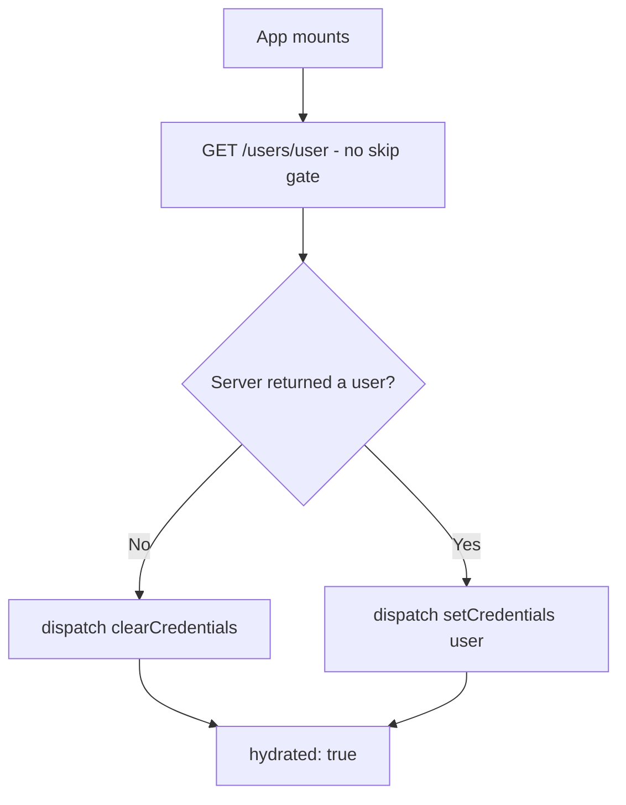
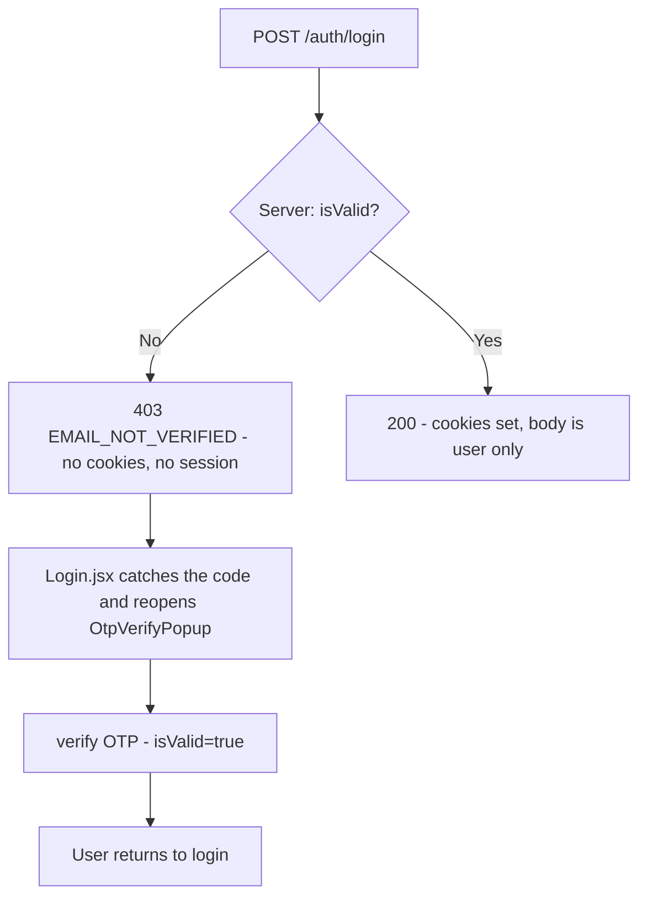
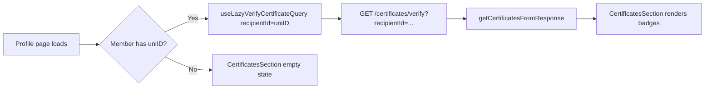
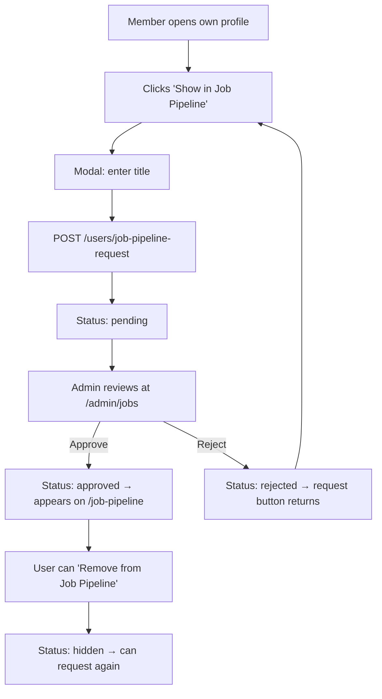
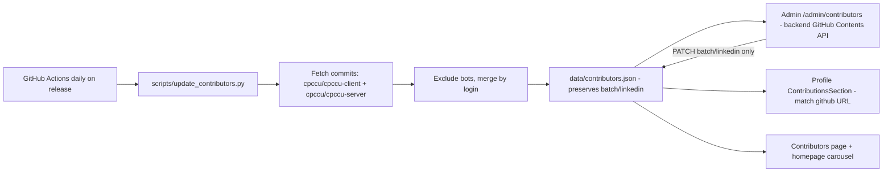

# CPCCU Frontend Architecture Documentation

This document describes the current architecture of the `cpccu-client` repository as it exists in production.

> **Rule of thumb:** when documentation and code disagree, **the code is correct**. This document is verified against the source tree.

> **Looking for the reasoning behind key decisions?** See [ADR.md](./ADR.md) — Architecture Decision Records covering deployment, certificates, roles, the profile system, the job pipeline, RTK Query, security headers, and auth.

> **Cross-repository note:** this document describes the frontend half of CPCCU. **The API half is now in this repository** — 53 App Router route handlers under `src/app/api/**` exposing 65 endpoints, reached same-origin at `/api/v1`, with the server foundation in `src/lib/server/`. See [BACKEND_MIGRATION.md](./BACKEND_MIGRATION.md) for the API half, and [DEPLOYMENT.md](./DEPLOYMENT.md) for how it is hosted. `cpccu-server` (the retired Express backend, a separate repository) is a read-only historical reference and is not part of this application's build or runtime.

## 1. Technology Stack

| Layer | Technology |
| --- | --- |
| Framework | Next.js 16 (App Router, `src/` directory) |
| Runtime UI | React 19 |
| Language | JavaScript (ES modules, JSX) |
| State Management | Redux Toolkit |
| Server State / Data Fetching | RTK Query |
| Styling | Tailwind CSS 4, Tailwind CSS Animate, Tailwind Merge |
| UI Component System | Radix UI primitives + `class-variance-authority` |
| Animation | Framer Motion |
| Icons | Font Awesome, Lucide React, React Icons |
| Validation | Zod |
| Date Handling | date-fns, React Day Picker |
| Charts | Recharts |
| Carousels | Embla Carousel React |
| Notifications | Sonner, SweetAlert2 |
| Command Palette | cmdk |
| OTP Input | input-otp |
| Image Crop | react-easy-crop |
| Upload | upload-js (Cloudinary) |
| Scroll | react-scroll, react-scroll-trigger |
| Panels | react-resizable-panels |
| Counters | react-countup |
| Spreadsheet Export | xlsx |
| Package Manager | npm / Bun |

## 2. Repository Layout

```
cpccu-client/
├── .github/workflows/       # update-contributors.yml — daily contributor sync
├── data/                    # Static JSON content sources (fallback data)
├── DOCUMENTATION/           # Project docs (this file, API docs, deployment, etc.)
├── lib/                     # Root-level shared utilities (cn.js)
├── public/                  # Static assets
├── scripts/                 # update_contributors.py
├── src/
│   ├── app/                 # Next.js App Router pages & layouts
│   ├── components/          # Feature and shared UI components
│   ├── Context/             # Scroll-based section contexts
│   ├── features/            # Redux slices + RTK Query endpoint modules
│   ├── hooks/               # use-admin-content, use-mobile, use-toast
│   ├── lib/                 # Utilities (roles, certificates, public-content, ...)
│   ├── proxy.ts             # Next.js 16 proxy (security headers)
│   └── services/            # RTK Query base API setup
```

## 3. Routing Architecture (App Router)

### 3.1 Root Shell

- Root layout `src/app/layout.jsx` imports `globals.css`, sets global metadata (`metadataBase` = `https://www.cpccu.club`), loads the Inria Sans Google Font, and wraps the app in `ProviderWrapper` (Redux Provider + auth hydration).
- `src/app/ScrollToTop.jsx` provides global scroll-to-top behavior.
- `src/app/not-found.jsx` renders the custom 404 page.

### 3.2 Main Public Route Group (`(main)`)

- Shared shell in `src/app/(main)/layout.jsx`: `Header` → `NavBar` → children → `Footer` → `GoToTop`.

| Route | Page |
| --- | --- |
| `/` | Homepage |
| `/blog` | Blog listing |
| `/bootcamp-leaderboard` | Bootcamp leaderboard |
| `/certificate` | Certificate verification portal |
| `/certificate/[certificateId]` | Per-certificate detail page (SSR metadata) |
| `/committee` | Committee page |
| `/contact` | Contact page |
| `/contributors` | Contributors page |
| `/donators` | Donators page |
| `/event` | Event page |
| `/gallery` | Gallery page |
| `/history` | Club history |
| `/job-pipeline` | Developer job pipeline |
| `/member` | Member directory |
| `/profile/[id]` | Public profile page |
| `/users/profile/[id]` | Legacy alias for the same profile page |

### 3.3 Auth and Utility Routes

| Route | Page |
| --- | --- |
| `/login` | Login page |
| `/signup` | Registration page with OTP verification |
| `/reset-password/[code]/[token]` | Password reset page |
| `/verify/[certificateId]` | Redirects to `/certificate/[certificateId]` |

### 3.4 Admin Routes (`/admin`)

- Client-side guard: each admin page imports `src/components/admin-layout.jsx`, which redirects unauthenticated users to `/login` once auth hydration completes, shows a loading state before hydration, and renders an "Admin access required" screen for non-admin roles (`admin`, `moderator`, `mentor`). (`src/app/admin/layout.jsx` is only a metadata pass-through; the actual guard lives in the `admin-layout` component.)
- Navigation is role-filtered in `src/components/admin-sidebar.jsx` (see the module table in §13).

| Route | Module |
| --- | --- |
| `/admin` | Dashboard |
| `/admin/members` | Members (incl. official role management) |
| `/admin/posts` | Posts |
| `/admin/messages` | Contact messages |
| `/admin/events` | Events |
| `/admin/gallery` | Gallery |
| `/admin/jobs` | Developer profiles / job pipeline |
| `/admin/alumni` | Alumni |
| `/admin/contributors` | Contributors |
| `/admin/donators` | Donators |
| `/admin/committees` | Committees |
| `/admin/certificates` | Certificates |
| `/admin/statistics` | Site statistics |
| `/admin/audit-logs` | Audit logs |
| `/admin/settings/account` | Account settings |
| `/admin/settings/system` | System settings |

## 4. State Management and Data Flow

### 4.1 Active Store Configuration

The active store is `src/app/redux/store.js`.

Registered reducers:

| Key | Source |
| --- | --- |
| `api` | `baseApi` RTK Query reducer |
| `auth` | auth slice |
| `certificate` | certificate slice |

Middleware: `baseApi.middleware`. The serializable check is disabled.

> **Correction (migration cleanup):** the store previously also registered a `publicApi` reducer and a second `publicApi.middleware` entry. That instance has been **deleted**. It existed only to reach the Express backend's root-level `GET /verify/:certificateId` (`cpccu-server/src/app.js:76`), which sat outside the `/api/v1` base URL; verification is now served at `/api/v1/certificates/verify/:certificateId` on the ordinary base URL, so a second instance is unnecessary. See §8.2 and `src/features/certificate/certificateApi.js`.

> `src/app/redux/rootReducer.js` is **stale** (it imports `usersSlice`/`postsSlice` files that do not exist) and is **not** used by the active store.

### 4.2 Auth Hydration Flow

`src/app/redux/ProviderWrapper.js` performs hydration on app load. The session is an `httpOnly` cookie the browser sends automatically, so there is nothing client-side to check first — the query runs **unconditionally**:


```mermaid
flowchart TD
    A[App mounts] --> D[GET /users/user - no skip gate]
    D --> E{Server returned a user?}
    E -- Yes --> F[dispatch setCredentials user]
    E -- No --> G[dispatch clearCredentials]
    G --> C[hydrated: true]
    F --> C
```

1. `AuthHydrator` calls `useGetCurrentUserQuery` (`GET /users/user`) with `pollingInterval: 0` and **no `skip` option**.
2. On success it dispatches `setCredentials` with the user the **server** returned. There is no `token` in that payload.
3. On failure — 401, 403, or any 5xx — it dispatches `clearCredentials`, which also removes the `user` and the stale `token` keys from `localStorage`.
4. `hydrated: true` is set in both reducers, so auth-aware UI unblocks in all cases.
5. The `httpOnly` cookies cannot be cleared from here; they are cleared by `POST /auth/logout` or they expire.

> ⚠️ **A `skip` gate is a correctness bug here, not an optimisation.** This flow used to read `localStorage.token` and skip the query when it was absent. The cutover removed the body token (the credential is a cookie no script can read), so `localStorage.token` became permanently null, `skip` became permanently true, `GET /users/user` never fired, and **every page rendered logged out**. The cost of asking unconditionally is one small 401-shaped request per anonymous page load; the cost of the gate is a site where nobody is ever signed in. `GET /users/user` is the sole authority on session identity.

### 4.3 Slice Responsibilities

| Slice | File | Registered | Purpose |
| --- | --- | --- | --- |
| `auth` | `src/features/auth/authSlice.js` | ✅ | `user`, `loading`, `error`, `hydrated`; `setCredentials` / `clearCredentials` / `setHydrated`. **No `token`** — the JWTs live only in `httpOnly` cookies this slice cannot read. `user` is mirrored to `localStorage` as a first-paint cache and is never proof of a session. |
| `certificate` | `src/features/certificate/certificateSlise.js` | ✅ | Certificate search form state (`searchData`) and verification result (`result`); `setSearchData` / `setCertificateResult` / `clearCertificateResult` |
| `users` | `src/features/users/userSlice.js` | ❌ | Exists but **not registered** in the active store |
| `members` | `src/features/members/memberSlice.js` | ❌ | Exists but **not registered** in the active store |
| `posts` | `src/features/posts/postSlice.js` | ❌ | Exists but **not registered** in the active store |

### 4.4 RTK Query API Layer

- `src/services/baseApi.js` — the single `createApi` instance (reducer path `api`), with the hard-coded **relative** base path `/api/v1`, `credentials: 'include'`, and **no `Authorization` header**. Feature modules inject endpoints via `baseApi.injectEndpoints()`.
- `src/features/certificate/certificateApi.js` injects the certificate endpoints (`verifyCertificate`, `getCertificateStats`, `getRecentCertificates`) into `baseApi`. It no longer creates a second `createApi` instance — `grep -rn "createApi(" src/` returns exactly one hit, `src/services/baseApi.js`.

**Tag types** (cache invalidation):

```
Auth, Users, Posts, Projects, PublicContent,
AdminOverview, AdminMembers, AdminContent, AdminContributors,
AdminStatistics, AdminCertificates, AdminSystemSettings, AdminRoles
```

> ⚠️ Code quirk: `memberApi.js` provides a `Members` tag, but `Members` is **not** declared in `baseApi.tagTypes`.

**Endpoint injection modules:**

| Module | File | Covers |
| --- | --- | --- |
| `authApi` | `features/auth/authApi.js` | login, register, send-otp, otp-verify, current user, logout, password reset |
| `userApi` | `features/users/userApi.js` | user CRUD, image upload, job pipeline request/remove, password change, account deletion, projects CRUD |
| `memberApi` | `features/members/memberApi.js` | public member directory |
| `certificateApi` | `features/certificate/certificateApi.js` | certificate verify/search, stats, recent + public verify |
| `contentApi` | `features/content/contentApi.js` | public content + statistics |
| `contactApi` | `features/contact/contactApi.js` | contact form submission |
| `adminApi` | `features/admin/adminApi.js` | admin overview, members, content, roles, statistics, system settings, certificates, image upload |

### 4.5 Direct Fetch (non-RTK Query)

| Location | Purpose |
| --- | --- |
| `src/components/HOME/VisitorCounter.jsx` | Visitor count fetch + increment, against `/api/v1/visitor` |
| `src/components/BOOTCAMPLEADERBOARD/BootcampLeaderboard.jsx` | Bootcamp leaderboard data, against `/api/v1/bootcamp-leaderboard` |
| `src/lib/certificate-metadata.js` | Certificate detail page metadata — **no longer an HTTP fetch**; it reads MongoDB directly through `src/lib/server/services/certificate.service.js` |

All of them use the same hard-coded relative `/api/v1` literal. There is no environment variable and no fallback branch; a stale absolute origin cannot be reintroduced without failing `test/client-endpoint-parity.test.js`.

## 5. Security Middleware (`src/proxy.ts`)

`src/proxy.ts` implements Next.js 16's proxy (middleware) convention. It exports `proxy(request)` and applies security headers to every route except `_next/static` and `_next/image` (via `config.matcher`):

- **Content-Security-Policy** — production only; restricts script/style/img/connect/font sources.
- **X-Content-Type-Options** — `nosniff`
- **Referrer-Policy** — `strict-origin-when-cross-origin`
- **Permissions-Policy** — disables camera, microphone, geolocation, usb, payment, accelerometer, gyroscope, magnetometer
- **X-Frame-Options** — `DENY`
- **Cross-Origin-Embedder-Policy** — `unsafe-none`
- **Cross-Origin-Opener-Policy** — `same-origin`
- **Cross-Origin-Resource-Policy** — `same-origin`
- **Strict-Transport-Security** — HSTS when the host is not `localhost`/`127.0.0.1`/`0.0.0.0`

## 6. Authentication

The session is an **`httpOnly` cookie**. The client holds no token (there is no client-side refresh flow and no Google OAuth flow):

1. **Login** (`POST /auth/login`) sets the `accessToken` / `refreshToken` cookies and returns `{ user }` — **no token in the body**. An **unverified** account gets `403 EMAIL_NOT_VERIFIED`, no cookies and no session, and the OTP popup reopens.
2. **Requests** — `baseApi` sets `credentials: 'include'` so the browser attaches the cookie, and attaches **no `Authorization` header`. The server still accepts a `Bearer` header as a fallback after the cookie, and uses its presence as the CSRF exemption for non-browser callers; the first-party web client does not use that exemption.
3. **Session validation** — `GET /users/user` on every page load is the **sole authority** on session identity. See §4.2; the `localStorage` `user` copy is a cache, not proof.
4. **Refresh** — transparent and server-side. `GET /auth/refresh-token` exists but the client never calls it; `src/lib/server/auth.js` re-issues the access-token cookie when it sees an expired one. `ACCESS_TOKEN_EXPIRE` being short is what makes this work.
5. **Logout** — `POST /auth/logout` (revokes this device's refresh token and clears the cookies) + `clearCredentials`. It was `GET` until the cutover; `GET` is exempt from the CSRF check, which made a cross-site force-logout — and seven-day refresh-token revocation — reachable. Do not add a `GET` fallback.
6. **Protected routes** — the admin layout is guarded client-side for roles `admin`, `moderator`, `mentor`. Non-admin users see "Admin access required". That guard is UX; the server enforces the same roles on every `/admin/*` route, auth-by-default.
7. **CSRF** — unsafe methods are checked in-process by `assertSameOrigin` (`src/lib/server/request.js`) against an allow-list seeded from `WEB_DOMAIN` and `NEXT_PUBLIC_SITE_URL`. A browser sends `Sec-Fetch-Site: same-origin` on a same-origin `fetch`, so the first-party client passes; a cross-site request is 403. A wrong allow-list value 403s every write while reads keep working.

Registration uses **email OTP verification**: `POST /auth/send-otp` → `POST /auth/verify-registration`, handled by `OtpVerifyPopup` after `POST /auth/register`.

**Email verification is enforced server-side** — the frontend cannot obtain a session for an unverified account:


```mermaid
flowchart TD
    A[POST /auth/login] --> B{Server: isValid?}
    B -- No --> C[403 EMAIL_NOT_VERIFIED - no cookies, no session]
    B -- Yes --> D[200 - cookies set, body is user only]
    C --> E[Login.jsx catches the code and reopens OtpVerifyPopup]
    E --> F[verify OTP - isValid=true]
    F --> G[User returns to login]
```

- `Login.jsx` (`src/components/LOGINSIGNUP/Login.jsx`) inspects the error payload for the `EMAIL_NOT_VERIFIED` code, opens the existing OTP verification popup, and stores **no** credentials.
- `OtpVerifyPopup` (6-char input, 60s resend countdown) calls `sendOtp` (resend) and `otpVerify` (`POST /auth/verify-registration`). On success it asks the user to log in again.

Password reset: `POST /auth/reset-link` (with `{ email }` in the body) sends the reset email; `PATCH /auth/reset-password` (with `code` + `token` from the URL) completes it. Passwords are validated with `src/lib/password-validation.js`. `reset-link` was `GET /auth/reset-link/:email` until the cutover: `GET` is exempt from the CSRF check and the address was in the path, so a bare cross-site `` could make the server mail a real reset link to an attacker-chosen address. Do not add a `GET` fallback.

## 7. Profile System

Route: `/profile/[id]` (page in `src/app/(main)/profile/[id]/page.jsx`, layout `src/components/Layout/Profile.jsx`).

### 7.1 Page Data Flow

- The page reads the current user from Redux; if the requested `id` matches the logged-in user (`_id` or `uniID`) it renders the local user, otherwise it fetches the public user via `useFetchUserByIdQuery` (`GET /users/user/:id`).
- Skeleton loading, "Unable to Load Profile" (error) and "Profile Not Found" states are handled in the page.
- Ownership (`isOwnProfile`) gates edit mode, image upload, project CRUD, and job pipeline controls.

### 7.2 Sections (active components in `src/components/PROFILE/`)

| Section | Component | Purpose |
| --- | --- | --- |
| Hero | `ProfileHero.jsx` | Avatar, cover band, official-role badge, department/batch/ID/member-since, socials, owner actions (Edit, Job Pipeline, Logout) |
| About | `AboutSection.jsx` | Biography / about text |
| Member Info | `MemberInfoSection.jsx` | Contact + academic details |
| Skills | `SkillsSection.jsx` | Skills with `skillName` + `experience` (grouped) |
| Projects | `ProjectsSection.jsx` | Portfolio projects (owner can CRUD/reorder) |
| Certificates | `CertificatesSection.jsx` | Dynamically fetched certificates (see §8) |
| Contributions | `ContributionsSection.jsx` | GitHub contributor widget (see §11) |
| Contact | `ContactSection.jsx` | Contact links |
| Quick Stats | `QuickStats.jsx` | Animated counters (projects, certificates, contributions) |
| Shared | `SectionCard.jsx` / `EmptyState.jsx` | Section wrapper + empty state |
| Utility | `AnimatedCounter.jsx`, `BrandIcons.jsx` | Counter animation + brand icons |
| Image | `ImageUploadModal.jsx`, `ProfileImageCropModal.jsx` | Upload + react-easy-crop flow |

> Legacy/unused profile components (`ProfileCard`, `ProfileDetails`, `ProfileID`, `ProfileBlog`, `Profile_Blog_Modal`, `ProfileNotFound`, `AchievementBadges`) remain in the folder but are only referenced by the unused `src/components/Layout/Profile1.jsx`.

### 7.3 Owner Permissions

- Edit toggle → inline form updates (`PATCH users/userInfo-update`).
- Avatar upload → `PATCH users/user/upload-image/:key` (crop via `src/lib/cropImage.js`).
- Skills add/remove/update.
- Projects create/update/delete.
- Job pipeline request/remove (see §9).

### 7.4 Public Profile Permissions

Visitors can view all sections; owner-only controls (edit, image upload, project management, job pipeline actions, logout) are hidden. Certificates and projects are fetched with public endpoints.

## 8. Certificate System

### 8.1 Verification Portal

- `/certificate` — search form (`VerifyForm`), stats (`CertificateStats`), recent certificates (`RecentCertificates`).
- `/certificate/[certificateId]` — same page pre-filled with the ID; `generateMetadata` calls `getCertificateMetadata`, which reads MongoDB through the certificate service rather than fetching its own origin.
- `/verify/[certificateId]` — legacy route that redirects to `/certificate/[certificateId]`.

### 8.2 APIs

| Endpoint | API | Auth |
| --- | --- | --- |
| `GET /certificates/verify?certificateId=&recipientName=&recipientId=` | `certificateApi.verifyCertificate` | No (public — declared `public: true` server-side) |
| `GET /certificates/stats` | `certificateApi.getCertificateStats` | No (public) |
| `GET /certificates/recent` | `certificateApi.getRecentCertificates` | No (public) |
| `GET /certificates/verify/:certificateId` | `certificateApi.verifyCertificate` (by-id path) | No (public — `public: true` in the route handler) |

> **Correction (migration cleanup).** This row previously read `GET /verify/:certificateId` | `publicApi.verifyCertificatePublic`. Both halves were wrong for the migrated backend.
>
> The **path** moved: the canonical by-id verification endpoint is now **`GET /api/v1/certificates/verify/:certificateId`**, served by `src/app/api/v1/certificates/verify/[certificateId]/route.js`. It runs the same `verifyCertificatePublic` controller the root route ran, so the response is identical. It is reached by the same `baseApi` instance as every other certificate endpoint — there is no longer a separate instance for it.
>
> The **root path is not migrated and cannot be.** The Express backend mounted `app.get('/verify/:certificateId', …)` at the very top of `app.js` (`cpccu-server/src/app.js:76`), which in App Router would be `src/app/verify/[certificateId]/route.js`. But `src/app/verify/[certificateId]/page.jsx` — the human-facing verification page — **already occupies that segment**, and App Router forbids a `page.jsx` and a `route.js` at the same segment (the build fails on the conflict). So this is not deferred work waiting for a later phase; the file is not legal to create. `publicApi` existed solely to reach that root path from a base URL that stripped `/api/v1`; both are now gone.
>
> ⚠️ Because `src/app/verify/[certificateId]/page.jsx` is a real client-side route, a request to the root path does **not** 404 — it returns rendered **HTML with HTTP 200**, and a client will render the verification page as if it were JSON. Point any remaining caller at `/api/v1/certificates/verify/:certificateId`, and treat a JSON parse failure on the root path as exactly this cause.

Search behavior: `certificateId` exact match; `recipientName` partial case-insensitive; `recipientId` case-insensitive. Name/ID searches can return multiple certificates.

### 8.3 How the Profile Integrates with Certificates


```mermaid
flowchart LR
    A[Profile page loads] --> B{Member has uniID?}
    B -- Yes --> C[useLazyVerifyCertificateQuery recipientId=uniID]
    C --> D[GET /certificates/verify?recipientId=...]
    D --> E[getCertificatesFromResponse]
    E --> F[CertificatesSection renders badges]
    B -- No --> G[CertificatesSection empty state]
```

Key facts:

- Certificates are **NOT stored in the user profile**.
- They are **fetched dynamically** from the certificate system using the member's **student ID** (`uniID`).
- The existing certificate system (backend `Certificate` collection) is the **single source of truth**.
- The profile only displays them; admins issue/verify certificates through `/admin/certificates`.

### 8.4 Utilities (`src/lib/certificates/`)

| File | Responsibility |
| --- | --- |
| `parser.js` | `getCertificatesFromResponse` — safely extracts an array from any response shape |
| `sorting.js` | `sortCertificatesNewest`, `sortCertificatesOldest`, `sortByIssueDate` |
| `badges.js` | Badge labels/colors/icons by certificate type (`winner`, `runner-up`, `participation`, ...) |
| `permissions.js` | Stubs preparing download/share/edit/delete capability checks (all return `false`) |
| `index.js` | Re-exports |

## 9. Job Pipeline

Public route `/job-pipeline` (component `src/components/Layout/JobPipeline.jsx`) reads approved developer profiles via `contentApi` (`GET /content/profiles`) and falls back to `data/job-pipeline/Info.json` on error.

Complete workflow:


```mermaid
flowchart TD
    A[Member opens own profile] --> B[Clicks 'Show in Job Pipeline']
    B --> C[Modal: enter title]
    C --> D[POST /users/job-pipeline-request]
    D --> E[Status: pending]
    E --> F[Admin reviews at /admin/jobs]
    F -->|Approve| G[Status: approved → appears on /job-pipeline]
    F -->|Reject| H[Status: rejected → request button returns]
    G --> I[User can 'Remove from Job Pipeline']
    I --> J[Status: hidden → can request again]
    H --> B
```

| State | User-visible behavior |
| --- | --- |
| `hidden` (default) | "Show in Job Pipeline" button |
| `pending` | "Requested for Job Pipeline" (disabled) |
| `approved` | "Shown in Job Pipeline" + "Remove from Job Pipeline" |
| `rejected` | Request button returns; rejection reason stored (`jobPipelineRejectionReason`) |

Admin module: `/admin/jobs` (`jobs-content.jsx`) supports approve / reject / revert / remove actions against `DeveloperProfile` records.

## 10. Dynamic Role System

### 10.1 Two Kinds of Roles

| Kind | Purpose | Managed in | Example |
| --- | --- | --- | --- |
| **System roles** | Backend permissions | Backend middleware / admin layout | `admin`, `moderator`, `mentor`, `member` |
| **Official roles** | Display-only CPCCU position titles | `/admin/members` (role dropdown) | President, Vice President, General Secretary, Treasurer |

Official roles are stored in the `Role` collection and displayed on member profiles (badge + emoji icon). System roles control access and are never shown as official titles (`getDisplayRole` returns `Member` for system roles).

### 10.2 Admin Role Management

Injected in `adminApi.js`:

| Endpoint | Purpose |
| --- | --- |
| `GET /admin/roles` | List all roles |
| `GET /admin/roles/active` | List only active roles |
| `POST /admin/roles` | Create a role |
| `PATCH /admin/roles/:id` | Update a role |
| `PATCH /admin/roles/:id/toggle` | Toggle active/inactive |

Tag: `AdminRoles`. The role dropdown and creation UI live inside `members-content.jsx`.

### 10.3 `src/lib/roles.js`

- `DEFAULT_CPCCU_ROLES` — canonical official role list (fallback)
- `normalizeRole(name)` — title-case normalization
- `isOfficialRole(role)` — membership check against the canonical list
- `getDisplayRole(officialRole)` — display-safe name (system roles → `Member`)
- `roleIcon(role)` — emoji icon mapping
- `roleBadgeColor(role)` — Tailwind badge color classes
- `sortRoles(roles)` — alphabetical sort

## 11. Contributors


```mermaid
flowchart LR
    A[GitHub Actions daily on release] --> B[scripts/update_contributors.py]
    B --> C[Fetch commits: cpccu/cpccu-client + cpccu/cpccu-server]
    C --> D[Exclude bots, merge by login]
    D --> E[data/contributors.json - preserves batch/linkedin]
    E --> F[Admin /admin/contributors - backend GitHub Contents API]
    F -->|PATCH batch/linkedin only| E
    E --> G[Profile ContributionsSection - match github URL]
    E --> H[Contributors page + homepage carousel]
```

- **Single source of truth:** `data/contributors.json` in this repo (`release` branch). The daily GitHub Action regenerates it from commits in **both** `cpccu/cpccu-client` and `cpccu/cpccu-server`, excluding bots and preserving the manually-managed fields (`name`, `role`, `department`, `batch`, `linkedin`).
- **Admin interaction (GitHub-synced, not generic content):** the `/admin/contributors` page (`src/components/contributors-content.jsx`) calls `GET /admin/contributors` (backend reads the JSON live from GitHub) and `PATCH /admin/contributors/:githubUsername` to write back **only `batch` and `linkedin`**. The role is fixed as "Contributor" (read-only), and GitHub info (name, username, avatar, commit count) is auto-synced. The backend requires `CONTRIBUTOR_GITHUB_TOKEN`; without it the page falls back to the bundled JSON with a warning banner.
- `src/lib/public-content.js` provides `extractGithubUsername`, `findContributorByGithub`, and `parseContributionInfo`; `ContributionsSection` matches the member's GitHub URL to a contributor record and renders rank/commits.
- The **public** Contributors page (`src/components/CONTRIBUTORS/ContributorsPage.jsx`) reads `GET /content/contributors` (legacy DB-backed resource) and falls back to `data/contributors.json` when the collection is empty or the request fails. Because the migration deliberately excluded `contributors.json`, the JSON is what actually renders.

## 12. Projects

- Data lives in the backend `Project` collection (keyed to users); projects are **not** stored in the profile document.
- Endpoints (injected via `userApi.js`): `GET /projects`, `POST /projects`, `PATCH /projects/:id`, `DELETE /projects/:id`, `GET /projects/user/:userId` (public).
- Tag: `Projects`.
- Profile usage: `getProjects` (owner) or `getPublicProjects` (visitor); `ProjectsSection` renders cards; owner edit mode adds create/update/delete.

## 13. Admin Panel Modules

| Module | Content source | Notes |
| --- | --- | --- |
| Dashboard | `GET /admin/overview` | Live stats + Recharts (area, bar, pie) |
| Members | `GET/POST/PATCH/DELETE /admin/members` | Approval, status, official role assignment |
| Posts | Generic content `posts` | Title, content, cover image, status |
| Events | Generic content `events` | Date phases, rewards, rules, buttons |
| Gallery | Generic content `gallery` + `gallery-events` | Image upload, event grouping |
| Certificates | `GET/POST/PATCH/DELETE /admin/certificates` | Issue, bulk issue, delete |
| Jobs | `GET /admin/content/profiles` | Developer profile review |
| Alumni | Generic content `alumni` | Alumni records with job history |
| Contributors | `GET/PATCH /admin/contributors` (GitHub Contents API) | GitHub-synced records — read-only GitHub fields, edit `batch`/`linkedin`; role fixed as Contributor |
| Donators | Generic content `donators` | Donator recognition |
| Committees | Generic content `committees` | Running/previous committees |
| Statistics | `GET /admin/statistics` | Live stats aggregated from real data sources |
| Audit Logs | Generic content `audit-logs` (read-only) | Admin action log |
| Messages | Generic content `messages` | Contact message triage |
| Account Settings | `userApi` + auth | Profile + password |
| System Settings | `GET/PATCH /admin/system-settings` | Site metadata, maintenance, appearance |

See [CPCCU_Admin_Panel_Implementation_Documentation.md](./CPCCU_Admin_Panel_Implementation_Documentation.md) for full module details.

## 14. Utilities (`src/lib/`)

| File | Responsibility |
| --- | --- |
| `roles.js` | Official role helpers (see §10.3) |
| `certificates/` | Certificate parsing/sorting/badges/permissions (see §8.4) |
| `certificates-data.js` | Static demo certificate dataset (`CERTIFICATES`, `CONTEST_NAMES`, `STATS`) |
| `public-content.js` | Public content mappers (`chooseLiveItems`, `toPublicContributor`, `toPublicEvent`, `groupGalleryItemsByEvent`, ...) + GitHub username extraction |
| `certificate-metadata.js` | Server-side metadata generation for `/certificate/[certificateId]` |
| `id-validation.js` | Student ID validation (`isValidStudentId`, `normalizeStudentId`, scientific-notation detection) |
| `password-validation.js` | Password strength rules + `validatePassword` |
| `format-date.js` | `formatDate` (UTC-stable date formatting) |
| `alerts.js` | SweetAlert2 helpers (`showSuccessAlert`, `showErrorAlert`, `showDeleteConfirm`, `showInfoAlert`, `showConfirmAlert`) |
| `cropImage.js` | `getCroppedImg` — canvas-based image crop for avatars |
| `demo-data.js` | Demo datasets (dashboard, members, events, gallery, posts, certificates, contributors, ...) — used only where live data is unavailable |
| `types.js` | Empty (placeholder) |
| `utils.js` | `cn()` — tailwind-merge + clsx |

## 15. Hooks

| Hook | Purpose |
| --- | --- |
| `useAdminContent(resource, fallback)` | Local CRUD state for generic admin content tables with RTK Query + fallback JSON |
| `useIsMobile()` | Mobile breakpoint detection (768px) via `matchMedia` |
| `useToast()` / `toast()` | Global toast system (limit 1, reducer-based) |

## 16. Context Providers (`src/Context/`)

- `BlogScroll` — Blog section navigation
- `ContactScroll` — Contact section navigation
- `EventScroll` — Event section navigation
- `GalleryScroll` — Gallery section navigation
- `OurMessionScroll` — Home mission section navigation

## 17. Environment Variables

[`.env.sample`](../.env.sample) is the authoritative list and documents each variable inline. Summary:

| Variable | Required | Used in |
| --- | --- | --- |
| `MONGODB_URI` | ✅ | `src/lib/server/db.js` |
| `ACCESS_TOKEN_SECRET` | ✅ | `src/lib/server/auth.js` |
| `REFRESH_TOKEN_SECRET` | ✅ | `src/lib/server/auth.js` |
| `PASSWORD_TOKEN_SECRET` | ✅ | `src/lib/server/controllers/auth.controller.js` |
| `WEB_DOMAIN` | ✅ in practice | `sentOtp.js` (reset-link host) **and** `request.js` (CSRF allow-list seed) |
| `NEXT_PUBLIC_SITE_URL` | ✅ in practice | `request.js` (CSRF allow-list seed). **Inlined at build time** |
| `EXTRA_ALLOWED_ORIGINS` | No | `request.js` — additive extra CSRF origins |
| `ACCESS_TOKEN_EXPIRE` / `REFRESH_TOKEN_EXPIRE` / `PASSWORD_TOKEN_EXPIRE` | Per feature | Token lifetimes. `ACCESS_TOKEN_EXPIRE` is load-bearing for transparent refresh |
| `CLOUDINARY_CLOUD_NAME` / `CLOUDINARY_API_KEY` / `CLOUDINARY_API_SECRET` / `CLOUDINARY_UPLOAD_PRESET` | For uploads | `src/lib/server/cloudinary.js` |
| `RESEND_API_KEY` | For email | `src/lib/server/sendEmail.js` |
| `VERBOSE_ERRORS` | No | `errors.js` — force raw or redacted error text regardless of `NODE_ENV` |
| `CONTRIBUTOR_GITHUB_TOKEN` | For contributor sync | `adminContent.controller.js` |
| `GOOGLE_SHEETS_API_KEY` / `BOOTCAMP_SHEET_ID` | For the leaderboard | `bootcampLeaderboard.controller.js` |

> The four ✅ entries are what `src/lib/server/env.js` hard-requires. Validation is **lazy, on first use**, so a deployment missing them builds green and fails at runtime with 500s rather than 401s. `WEB_DOMAIN` / `NEXT_PUBLIC_SITE_URL` are not in that list, but a wrong value 403s every unsafe method — treat them as required in practice. `NODE_ENV` is set by the build and the platform; do not set it by hand. **There is no API base URL variable** — the path is the hard-coded relative `/api/v1`.

See [DEPLOYMENT.md](./DEPLOYMENT.md) for production configuration.

## 18. Current Notes and Inconsistencies

- The certificate slice filename is `certificateSlise.js` (typo, wired and working).
- `src/features/posts/postApi.js` is empty; posts use the generic admin content API.
- `src/app/redux/rootReducer.js` is stale and not used (imports non-existent files).
- `userSlice.js`, `memberSlice.js`, `postSlice.js` are not registered in the store.
- Several endpoint URLs in `userApi.js` omit the leading `/` (functional due to `fetchBaseQuery` resolution).
- `createUser` (`POST /users/user`), `deleteUser` (`DELETE /users/:id`) and `fetchMemberById` (`GET /users/member/:id`) had no route in either backend and have been **deleted**, with the reason recorded in place. The `Members` tag type went with them and is no longer declared anywhere.
- `GET /auth/refresh-token` exists on the server but the client never calls it — renewal is transparent and server-side.
- `src/components/ADMIN/AdminPanel.jsx`, `src/components/Layout/Profile1.jsx`, and the legacy `PROFILE` components (`ProfileCard`, `ProfileDetails`, `ProfileID`, `ProfileBlog`, `Profile_Blog_Modal`, `ProfileNotFound`) are unused code kept in the tree.
- There are two `ui/` folders (`src/components/ui/` and `src/components/CERTIFICATE/ui/`) with duplicated shadcn-style components.
- `generateCertificateId` is a **local function** inside `src/components/certificates-content.jsx` (there is no `generateCertificateId.js` file).
- `render.yaml` / `_render.yaml` were the old Render deploy blueprints and are **deleted on purpose** — production hosting is **Vercel**. Do not restore them.
- **No seed script exists in this repository.** The JSON→Mongo seeder lives only in the archived `cpccu-server` repo and has not been ported, so a fresh database stays empty and public pages fall back to `data/*.json`.
- `scripts/update_contributors.py` still fetches commit counts from `cpccu/cpccu-server`, so the contributor pipeline still depends on that archived repository being readable.
